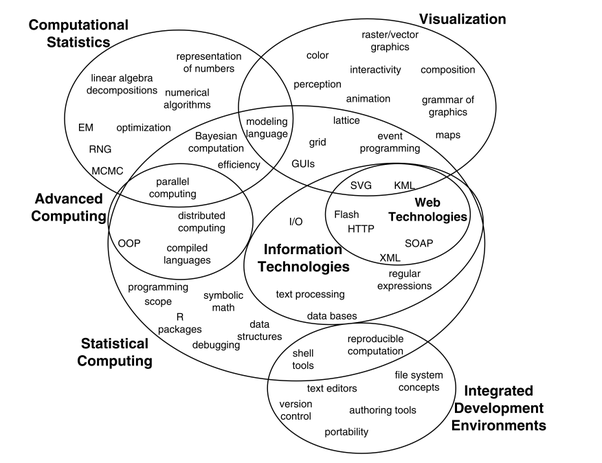
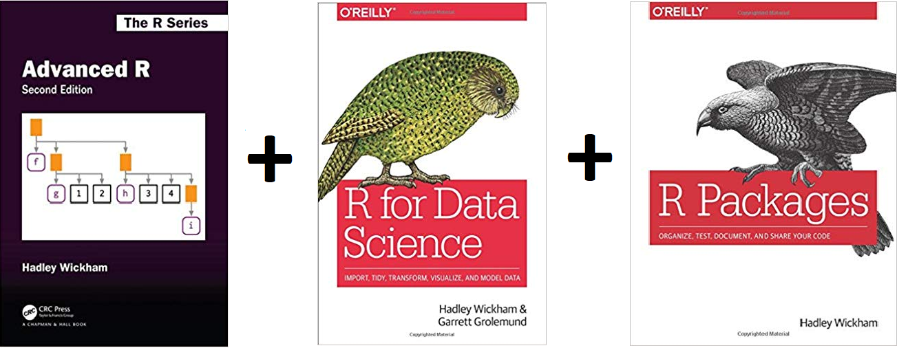
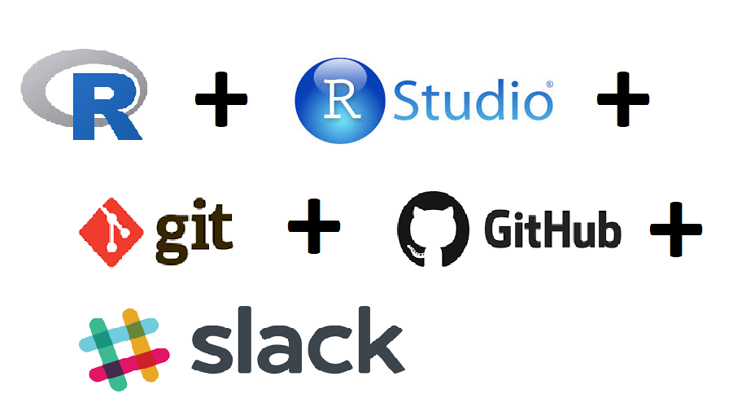

```{r include=FALSE}
knitr::opts_chunk$set(echo = TRUE, message = FALSE, warning = FALSE,
                      comment = "#>", highlight = TRUE,
                      fig.align = "center")
```

## Supplementary materials

Companion videos

- [Overview](https://warpwire.duke.edu/w/eyAEAA/)

---

class: center, inverse, middle

# Introduction

---

## Who am I?

- [Shawn Santo](https://www.shawnsanto.com)

- [shawn.santo@duke.edu](mailto:shawn.santo@duke.edu)

- Office hours (Zoom link in Sakai) 
    - Mondays 8:15pm - 9:15pm
    - Fridays 11:30am - 12:30pm
  
<br/><br/>

.small-text[
*All times listed are in Eastern Time.*
]

---

## Who else is involved?

- [Federico Ferrari](https://fedfer.github.io/)
  - [federico.ferrari@duke.edu](mailto:federico.ferrari@duke.edu)
  - Office hours (Zoom link in Sakai)
      - Tuesdays 4:00 - 5:00pm

- [Quinn Frank](https://github.com/quinnfrank)
  - [quinn.frank@duke.edu](mailto:quinn.frank@duke.edu)
  - Office hours (Zoom link in Sakai)
    - Tuesdays 1:30pm - 2:30pm
    - Thursdays 1:30pm - 2:30pm

<br/><br/>

.small-text[
*All times listed are in Eastern Time.*
]

---

## What is statistical programming?

.middle.center[


]

.small-text[
*Source:* Deborah Nolan & Duncan Temple Lang (2010) Computing in the Statistics
Curricula, The American Statistician, 64:2, 97-107, DOI: 
[10.1198/tast.2010.09132](https://doi.org/10.1198/tast.2010.09132)
]

---

## Some topic covered

.pull-left[

- Fundamentals of R

- S3 OO system

- Data visualization with package `ggplot2`

- Package `tidyverse`

- Web scraping

- Web based applications with RShiny

- Wrangling and managing big data

- Databases, SQL, and NoSQL

]

.pull-right[

- Data types and functions

- Parallelization

- Version control with git and GitHub

- Shell

- Reproducible reports with R Markdown

- Debugging and testing

- Spark

- Make

]

<br><br>

[Full course schedule](http://www2.stat.duke.edu/courses/Fall20/sta523/schedule.html)

---

## Why this class matters

>Programming Languages: Python and R continue to dominate. The new entry this 
year was Javascript, which got a respectable 6.8% share. Julia share has 
increased, while most other languages have declined. 

.tiny-text[

| Platform                             | 2019 % share | 2018 % share | % change |
|--------------------------------------|--------------|--------------|----------|
| Python                               | 65.8%        | 65.6%        | 0.2%     |
| R Language                           | 46.6%        | 48.5%        | -4.0%    |
| SQL Language                         | 32.8%        | 39.6%        | -17.2%   |
| Java                                 | 12.4%        | 15.1%        | -17.7%   |
| Unix shell/awk                       | 7.9%         | 9.2%         | -13.4%   |
| C/C++                                | 7.1%         | 6.8%         | 3.7%     |
| Javascript                           | 6.8%         | na           | na       |
| Other programming and data languages | 5.7%         | 6.9%         | -17.1%   |
| Scala                                | 3.5%         | 5.9%         | -41.0%   |
| Julia                                | 1.7%         | 0.7%         | 150.4%   |
| Perl                                 | 1.3%         | 1.0%         | 25.2%    |
| Lisp                                 | 0.4%         | 0.3%         | 46.1%    |

]

.small-text[
*Source:* https://www.kdnuggets.com/2019/05/poll-top-data-science-machine-learning-platforms.html
]

---

## Why this class matters

Some 2020 internships:

- <b>Mayo Clinic :</b> <i> Interns will work with statisticians,
bioinformaticists, and clinical investigators on research projects in areas
such as clinical trials, statistical genetics, and bioinformatics.
Experience with SAS and/or R preferred.</i>

- <b>Netflix (Science and Analytics):</b> <i> Comfortable coding
in at least one language (e.g., R, Python, Java, Scala, C++), experience
preferred with version control (e.g., git), great communication skills,
both oral and written.</i>

- <b>Two Sigma:</b>
<i> Use the scientific method to develop sophisticated investment models and
shape our insights into how the markets will behave. Create and test complex
investment ideas and partner with our engineers to test your theories.
You should possess the following qualifications: Demonstrate intermediate
skills in at least one programming language, performed an in-depth research
project, examining real-world data, are an independent thinker who can
creatively approach data analysis and  communicate complex ideas clearly.</i>

<br/>

.small-text[
*Source:* https://stattrak.amstat.org/2019/12/01/2020-internship-listings/
]

---

class: center, inverse, middle

# Course essentials

---

## Text toolkit

.middle.center[


]

These are recommended textbooks - **all are available for free online**.
There is no required textbook for this course.

---

## Software toolkit

.middle.center[


]


---

## Course structure

This class is about you doing as opposed to you just watching or listening.
In-person and Zoom, lectures and labs will be interactive. My role as instructor
is to introduce you to new tools and techniques, but it is up to you to take
them and make use of them. If you only read the code and never run it or
experiment with it, then you will not get much out of this course. Most slides
will include supplemental resources for you to delve deeper into the topic of
discussion. Occasionally, there will be pre-class readings in order to enrich
our lecture and lab experiences.

---

## Grading

| Grade Item | Percentage |
|-----------:|:----------:|
|   Homework |     45%    |
|     Exam 1 |     20%    |
|     Exam 2 |     20%    |
|    Project |     15%    |

<br/><br/>

The exact ranges for letter grades may be curved and cutoffs will be determined
at the end of the semester. However, if you have a cumulative numerical average
of 90 - 100, you are guaranteed at least an A-, 80 - 89 at least a B-, 70 - 79
at least a C-, and so on.

---

## Teams

I will initially construct teams based on the first-day class survey (link
available later in the slides).

Team expectations:

- Each member must commit to giving equal effort.

- Each member must read, run, and understand all code in a final submission.

- Each member must honestly complete the intragroup peer evaluation.

---

## Policies - sharing / reusing code

- Similar reproducible examples (reprex) exist online that will help you
  answer many of the questions posed on labs and homework assignments. Use of
  these resources is allowed unless it is written explicitly on the assignment.

- You must always cite any code you copy or use as inspiration. Copied code
  without citation is plagiarism and will result in a 0 for the assignment.
  There may also be additional punitive measures taken depending on the
  severity of plagiarism.

- Copying and citing a large amount of code to satisfy a main objective of an
  assignment will result in a 0 for the assignment.

- Discussion (not code sharing / copying) with other students and groups is
  allowed unless stated otherwise on an assignment.

- Carefully read each assignment so you know what is permitted and
  what is not. If you are ever unsure about what is allowed, please ask myself 
  or one of the TAs.

---

## Getting help

- Post your content and course related questions on Slack.

- Attend office hours.

- Set up a Zoom meeting with me or one of the TAs.

- Email me or one of the TAs.

---

## Links to bookmark

- Course page: http://www2.stat.duke.edu/courses/Fall20/sta523/

- GitHub organization: https://github.com/sta523-fa20

  - I'll send out an invite to join once I have everyone's user name

- DSS RStudio servers: to access, first connect to Duke's network via VPN.
  Navigate to one of:

  - rook - http://rook.stat.duke.edu:8787/
  - knight - http://knight.stat.duke.edu:8787/

---

## To do list

Before Wednesday's lecture please complete the following (in order).

1. Create a GitHub account.

    - https://github.com/join

2. Join the course's Slack workspace.

  - link was sent in the welcome email on 08-14-20

3. Verify you can log-in to the Department's RStudio Pro servers.

4. Complete the first-day survey.
  
  - posted in Slack under `#general`

5. Download the most up-to-date versions of R and RStudio locally.

---

## References

1. Deborah Nolan & Duncan Temple Lang (2010) Computing in the Statistics
   Curricula, The American Statistician, 64:2, 97-107,
   DOI: 10.1198/tast.2010.09132

2. Piatetsky, G. (2019). Python leads the 11 top Data Science, Machine Learning
   platforms: Trends and Analysis. Kdnuggets.com. Retrieved from
   https://www.kdnuggets.com/2019/05/poll-top-data-science-machine-learning-platforms.html

