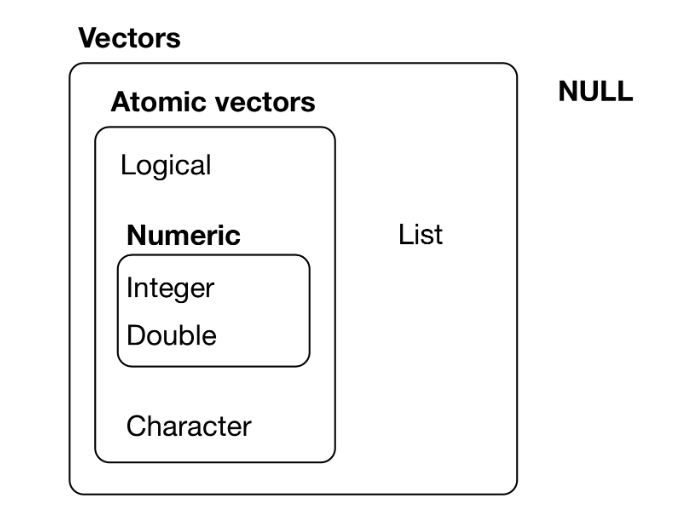

```{r include=FALSE}
knitr::opts_chunk$set(echo = TRUE, message = FALSE, warning = FALSE,
                      comment = "#>", highlight = TRUE,
                      fig.align = "center")
library(flair)
```

## Supplementary materials

Full video lecture available in Zoom Cloud Recordings

Companion videos

- [RStudio Tour](https://warpwire.duke.edu/w/4zEEAA/)
- [Vectors](https://warpwire.duke.edu/w/rzEEAA/)
- [Operators, vectorization, and length coercion](https://warpwire.duke.edu/w/rTEEAA/)
- [Control flow](https://warpwire.duke.edu/w/pzEEAA/)
- [Error action](https://warpwire.duke.edu/w/qzEEAA/)
- [Loops](https://warpwire.duke.edu/w/sTEEAA/)

.small-text[
Videos were created for STA 323 & 523 - Summer 2020
]

Additional resources

- [Google’s R Style Guide](https://google.github.io/styleguide/Rguide.html)
- [Hadley's R Style Guide](http://r-pkgs.had.co.nz/style.html)
- [Sections 3.1 – 3.2](https://adv-r.hadley.nz/vectors-chap.html) Advanced R
- [Chapter 5](https://adv-r.hadley.nz/control-flow.html) Advanced R

---

class: inverse, center, middle

# Vectors

---

## Vectors

The fundamental building block of data in R is a vector (collections of related 
values, objects, other data structures, etc).

--

R has two types of vectors:

* **atomic** vectors 

    - homogeneous collections of the *same* type (e.g. all logical values, 
      all numbers, or all character strings).

* **generic** vectors
  
    - heterogeneous collections of *any* type of R object, even other lists 
      (meaning they can have a hierarchical/tree-like structure).
    
<br><br>

I will use the term component or element when referring to a value
inside a vector.

---

## Vector interrelationships

.middle.center[



]

.small-text[
*Source*: https://r4ds.had.co.nz/vectors.html
]

---

## Atomic vectors

R has six atomic vector types: 
  
.center[
`logical`, `integer`, `double`,  `character`, `complex`, `raw`      
]

In this course we will mostly work with the first four. You will rarely work
with the last two types - complex and raw.

```{r}
x <- c(T, F, TRUE, FALSE)
typeof(x)

y <- c("a", "few", "more", "slides")
typeof(y)
```

---

## Coercion hierarchy

If you try to combine components of different types into a single atomic vector, 
R will try to coerce all elements so they can be represented as the simplest 
type.

.center[
`character` $\rightarrow$ `double` $\rightarrow$ `integer` $\rightarrow$ `logical`
]

```{r results='hide'}
x <- c(T, 5, F, 0, 1)
y <- c("a", 1, T)
z <- c(3.0, 4L, 0L)
```

--
.pull-left[
```{r}
x
y
z
```
]

.pull-right[
```{r}
typeof(x)
typeof(y)
typeof(z)
```
]

---

## Concatenation

One way to construct atomic vectors is with function `c()`.

```{r}
c(1, 0, 1, 1, 6)
c(c(3, 4), c(10, TRUE))
c(pi)
```

---

class: inverse, center, middle

# Operators, vectorization, and length coercion

---


## Logical (Boolean) operators

|  Operator                     |  Operation    |  Vectorized? 
|:-----------------------------:|:-------------:|:------------:
| <code>x &#124; y</code>       |  or           |   Yes        
| `x & y`                       |  and          |   Yes        
| `!x`                          |  not          |   Yes        
| <code>x &#124;&#124; y</code> |  or           |   No         
| `x && y`                      |  and          |   No         
|`xor(x,y)`                     |  exclusive or |   Yes    

<br><br>

--

What do we mean if we say a function or operation is vectorized?

---

## Boolean examples

```{r}
x <- c(T, F, T, T)
y <- c(F, F, T, F)
```

--

.pull-left[
```{r}
!x
x | y
x || y

```
]

--

.pull-right[
```{r}
x & y
x && y
xor(x, y)
```
]

---

## Comparison operators

|  Operator  |  Comparison                |  Vectorized?
|:----------:|:--------------------------:|:----------------:
| `x < y`    |  less than                 |  Yes
| `x > y`    |  greater than              |  Yes
| `x <= y`   |  less than or equal to     |  Yes
| `x >= y`   |  greater than or equal to  |  Yes
| `x != y`   |  not equal to              |  Yes
| `x == y`   |  equal to                  |  Yes
| `x %in% y` |  contains                  |  Yes (over `x`)

---

## Comparison examples

```{r}
x <- c(4, 10, -5)
y <- c(0, 51, 9 / 5)
z <- c("four", "for", "4")
```

--

.pull-left[
```{r}
x > y
x != y
```
]

--

.pull-right[
```{r}
x == z
x %in% z
```
]

---

## What else is vectorized?

- Most of the mathematical operators

- Many functions in `base` R and created by user's in packages

```{r}
a <- c(0, -3, sqrt(75))
b <- c(1, 3, 2)
```


.pull-left[
```{r}
a + b
a ^ b
```
]

.pull-right[
```{r}
rnorm(n = 3, mean = a, sd = b)
exp(a / b)
```
]

---

## Length coercion (vector recycling)

The shorter of two atomic vectors in an operation is recycled until it is the 
same length as the longer atomic vector.

```{r}
x <- c(2, 4, 6)
y <- c(1, 1, 1, 2, 2)
```

.small-text[
```{r}
x > y
x == y
10 / x
```
]

---

class: inverse, center, middle

# Control flow

---

## Conditional control flow

Conditional (choice) control flow is governed by `if` and `switch()`.

.pull-left[
```{r eval=FALSE}
if (condition) {
  # code to run
  # when condition is
  # TRUE
}
```
]

.pull-right[
```{r eval=FALSE}
if (TRUE) {
  print("The condition must have been true!")
}
```
]


---

## `if` examples

```{r}
if (1 > 0) {
  print("Yes, 1 is greater than 0.")
}
```

--

```{r}
x <- c(1, 2, 3, 4)
if (3 %in% x) {
  print("Yes, 3 is in x.")
}
```

--

```{r}
if (-6) {
  print("Other types are coerced to logical if possible.")
}
```

---

## More `if` examples

```{r warning=TRUE}
if (c(F, T, T)) {
  print("How many logical values can if handle?")
}
```

--

```{r}
x <- c(1, 2, 3, 4)
if (x %in% 3) {
  print("This works?")
}
```

```{r}
if (c(1, 0, 1)) {
  print("Other types are coerced to logical if possible.")
}
```

<br/>

.small-text[
I suppressed warnings in the last two examples.
]

---

## `if` is not vectorized

To remedy this potential problem of a non-vectorized `if`, you can

1. try to collapse a logical vector of length greater than 1
   to a logical vector of length 1 with functions

    - `any()`
    - `all()`

2. use a vectorized conditional function such as `ifelse()` or
   `dplyr::case_when()`.

---

## Functions `any()` and `all()`

```{r}
x <- c(-5, 0, 5, 10, 15)
any(x >= 5)
all(x >= 5)
```

<br/><br/>

Functions `any()` and `all()` require a logical vector as input.

---

## Vectorized `if`

```{r}
z <- c(-4:-1, 1:3)
z
ifelse(test = z < 0, yes = "neg", no = "pos")
```

<br>
--

```{r}
set.seed(532)
x <- rnorm(n = 4, mean = 0, sd = 1)
x
ifelse(test = abs(x) > 3, yes = "outlier", no = "no outlier")
```

---

## Nested conditionals

.pull-left[
```{r eval=FALSE}
if (condition_one) {
  ##
  ## Code to run
  ##
} else if (condition_two) {
  ##
  ## Code to run
  ##
} else {
  ##
  ## Code to run
  ##
}
```
]

.pull-right[
```{r}
x <-  0
if (x < 0) {
  "Negative"
} else if (x > 0) {
  "Positive"
} else {
  "Zero"
}
```
]

---

class: inverse, middle, center

# Error action

---

## Execute error action

Functions `stop()` and `stopifnot()` execute an error action. These are useful
if you want to validate inputs or function arguments.

```{r error=TRUE}
x <- -1
if (x < 0) {
  stop("Negative numbers not allowed!")
}
```

<br>
--

```{r error=TRUE}
x <- c(3, 9, 28)
stopifnot(any(x >= 0), all(x %% 3 == 0))
```

If any of the expressions in function `stopifnot()` are not `TRUE`, then
function `stop()` is called and an error message is shown.


---

## Exercises

1. What does each of the following return? Run the code to check your answer.
    ```{r eval=FALSE}
    if (1 == "1") "coercion  works" else "no coercion "
    
    ifelse(5 > c(1, 10, 2), "hello", "olleh")
    ```
<br>

2. Consider two vectors, `x` and `y`, each of length one. Write a set of
   conditionals that satisfy the following.
   
    - If `x` is positive and `y` is negative or `y` is positive and `x` is
      negative, print "knits".
    - If `x` divided by `y` is positive, print "stink".
    - Stop execution if `x` or `y` are zero.
    
  Test your code with various `x` and `y` values. Where did you
  place the stop execution code?
  
???

## Solutions

1.
.solution[
```{r}
if (1 == "1") "coercion  works" else "no coercion "
ifelse(5 > c(1, 10, 2), "hello", "olleh")
```
]
2.
.solution[
```{r}
x <- 4
y <- -10

if (x == 0 | y == 0) {
  stop("One of x or y is 0!")
} else if (x / y > 0) {
  print("stink")
} else {
  print("knits")
}
```
]

---

class: inverse, middle, center

# Loops

---

## Loop types

R supports three types of loops: `for`, `while`, and `repeat`.

```{r eval=FALSE}
for (item in vector) {
  ##
  ## Iterate this code
  ##
}
```

```{r eval=FALSE}
while (we_have_a_true_condition) {
  ##
  ## Iterate this code
  ##
}
```

```{r eval=FALSE}
repeat {
  ##
  ## Iterate this code
  ##
}
```

In the `repeat` loop we will need a `break` statement to end iteration.

---

## `for` loop

A `for` loop allows you to iterate code over items in a vector.

```{r}
k <- 0
for (i in c(2, 4, 6, 8)) {
  print(i ^ 2)
  k <- k + i ^ 2
}
```

--

```{r}
k
```

--

```{r}
for (i in c(2, 4, 6, 8)) {
  i ^ 2
}
```

*Automatic printing is turned off inside loops.*

???
.tiny[
```{r}
i <- 10
for (i in 1:3) {
  print("Today is Tuesday.")
}
i
```
]

Variable `i` is overwritten when `for` is executed. Thus, `i` is assigned
to the current environment. Convention is to use `i`, `j`, `k` as loop items.
It will be best to avoid using these as named objects elsewhere in your code.

---

## `while` loop

A `while` loop will iterate code until a given condition is `FALSE`.

```{r}
i <-  1
res <- rep(0, 10)

i
res
```

--

```{r}
while (i <= 10) {
  res[i] <- i ^ 2
  i <- i + 1
}

res
```

---

## `repeat` loop

A `repeat` loop will iterate code until a `break` statement is executed.

```{r}
i <- 1
res <- rep(NA, 10)

repeat {
  res[i] <- i ^ 2
  i <- i + 1
  if (i > 10) {break}
}

res
```

---

## Loop keywords: `next` and `break`

- `next` exits the current iteration and advances the looping index

- `break` exits the loop

- Both `break` and `next` apply only to the innermost of nested loops.

```{r eval=FALSE}
for (i in 1:10) {
  if (i %% 2 == 0) {next} #<<
  
  print(paste("Number ", i, " is odd."))
  
  if (i %% 7 == 0) {break} #<<
}
```

--

```{r echo=FALSE}
for (i in 1:10) {
  if (i %% 2 == 0) {next}
  
  print(paste("Number ", i, " is odd."))
  
  if (i %% 7 == 0) {break}
}
```

---

## Ancillary loop functions

You may want to loop over indices of an object as opposed to the object's values.
To do this, consider using one of `length()`, `seq()`, `seq_along()`, and
`seq_len()`.

.pull-left[
```{r}
4:7
length(4:7)
seq(4, 7)
```
]

.pull-right[
```{r}
seq_along(4:7)
seq_len(length(4:7))
seq(4, 7, by = 2)
```
]

<br>

Iterating over `seq_along(x)` is a better option than `1:length(x)`.

---

## Loop tips

1. Preallocate your output object when possible.

2. Don't use a `while` or `repeat` loop if a `for` loop is possible.

3. Don't use any type of loop if vectorization is possible.

--

.pull-left[
Slow...
```{r eval=FALSE}
a <- c()
for (i in seq_len(10)) {
  a <- c(a, i ^ 3)
}
```
]

--

.pull-right[
Faster...
```{r eval=FALSE}
a <- numeric(10)
for (i in seq_len(10)) {
  a[i] <- i ^ 3
}
```
]

--

Even faster...

```{r eval=FALSE}
(1:10) ^ 3
```

---

## Exercises

1. Consider the vector `x` below.
    ```{r eval=FALSE}
    x <- c(3, 4, 12, 19, 23, 49, 100, 63, 70)
    ```
Write R code that prints the perfect squares in `x`.
<br><br>
2. Consider `z <- c(-1, .5, 0, .5, 1)`. Write R code that prints
   the smallest non-negative integer $k$ satisfying the inequality
   $$\lvert cos(k) - z \rvert < 0.001$$
   for each component of `z`.

???

## Solution

1.
.solution[
```{r}
x <- c(3, 4, 12, 19, 23, 49, 100, 63, 70)

for (i in x) {
  if (sqrt(i) %% 1) {
    next
  }
  print(i)
}
```
]

2.
.solution[
```{r}
for (z in c(-1, .5, 0, .5, 1)) {
  k <- 0
  while (abs(cos(k) - z) >= .001) {
    k <- k + 1
  }
  print(k)
}
```
]

---

## References

1. Grolemund, G., & Wickham, H. (2019). R for Data Science. https://r4ds.had.co.nz/

2. Wickham, H. (2019). Advanced R. https://adv-r.hadley.nz/
