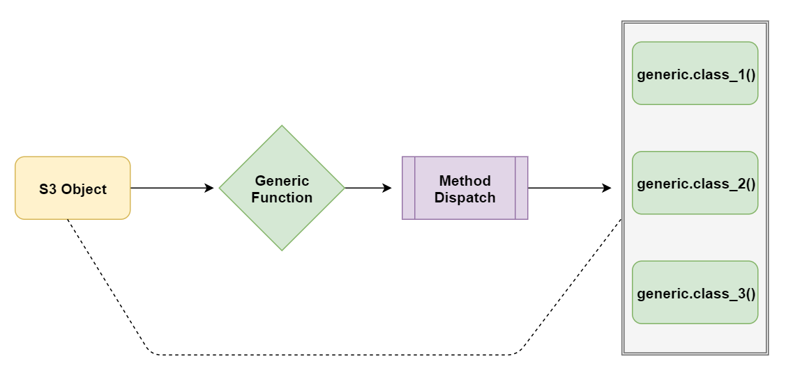
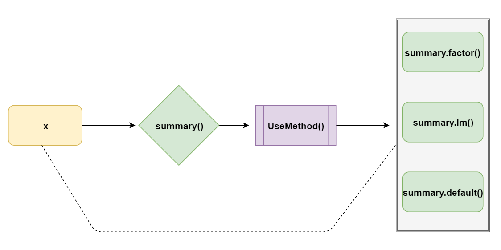

```{r include=FALSE}
knitr::opts_chunk$set(echo = TRUE, message = FALSE, warning = TRUE,
                      comment = "#>", highlight = TRUE,
                      fig.align = "center")
```

## Supplementary materials

Full video lecture available in Zoom Cloud Recordings

Companion videos

- [Subsetting matrices and data frames](https://warpwire.duke.edu/w/31UEAA/)


Additional resources

- [Object oriented program introduction](https://adv-r.hadley.nz/oo.html), Advanced R
- [Chapter 12](https://adv-r.hadley.nz/base-types.html), Advanced R
- [Sections 13.1 - 13.4](https://adv-r.hadley.nz/s3.html), Advanced R
- Create your own S3 vector classes with package [vctrs](https://vctrs.r-lib.org/articles/s3-vector.html)

---

class: inverse, center, middle

# Recall

---

## Subsetting techniques

R has three operators (functions) for subsetting:
1. `[`
2. `[[`
3. `$`

Which one you use will depend on the object you are working with, its
attributes, and what you want as a result.

We can subset with

- integers
- logicals
- `NULL`, `NA`
- character values

---

class: inverse, center, middle

# Subsetting matrices, arrays, and data frames

---

## Subsetting matrices and arrays

```{r}
(x <- matrix(1:6, nrow = 2, ncol = 3))
```

.pull-left[
```{r}
x[1, 3]
x[1:2, 1:2]
```
]

.pull-right[
```{r}
x[, 1:2]
x[-1, -3]
```
]

---

## Do I always get a matrix (array) in return?

.pull-left[
```{r}
x[1, ]
attributes(x[1, ])
```
]

.pull-right[
```{r}
x[, 2]
attributes(x[, 2])
```
]

--

For matrices and arrays `[` has an argument `drop = TRUE` that coerces the
result to the lowest possible dimension.

--

.tiny[
```{r}
x[1, , drop = FALSE]
attributes(x[1, , drop = FALSE])
```
]

---

## Preserving vs simplifying subsetting

Type             |  Simplifying             |  Preserving
:----------------|:-------------------------|:-----------------------------------------------------
Atomic Vector    |  `x[[1]]`                |  `x[1]`
List             |  `x[[1]]`                |  `x[1]`
Matrix / Array   |  `x[1, ]` <br/> `x[, 1]` |  `x[1, , drop=FALSE]` <br/> `x[, 1, drop=FALSE]`
Factor           |  `x[1:4, drop=TRUE]`   |  `x[1:4]`
Data frame       |  `x[, 1]` <br/> `x[[1]]` |  `x[, 1, drop=FALSE]` <br/> `x[1]`


By preserving we mean retaining the attributes. It is good practice to use
`drop = FALSE` when subsetting a n-dimensional object, where $n > 1$.

<br/>

The drop argument for factors controls whether the levels are preserved or not.
It defaults to `drop = FALSE`.

---

## Subsetting data frames

Recall that data frames are lists with attributes `class`, `names`, `row.names`.
Thus, they can be subset using `[`, `[[`, and `$`. They also support
matrix-style subsetting (specify rows and columns to subset).

```{r}
df <- data.frame(coin  = c("BTC", "ETH", "XRP"),
                 price = c(10417.04, 172.52, .26),
                 vol   = c(21.29, 8.07, 1.23)
                 )
```

--

What will the following return?

.pull-left[
```{r eval=FALSE}
df[1]

df[c(1, 3)]

df[1:2, 3]

df[, "price"]
```
]

.pull-right[
```{r eval=FALSE}
df[[1]]

df[["vol"]]

df[[c(1, 3)]]

df[[1, 3]]
```
]

???

What will the following return?

.tiny[
.pull-left[
```{r}
df[1]

df[c(1, 3)]

df[1:2, 3]

df[, "price"]
```
]

.pull-right[
```{r}
df[[1]]

df[["vol"]]

df[[c(1, 3)]]

df[[1, 3]]
```
]
]

---

class: inverse, center, middle

# Subsetting extras

---


## Subassignment

Indexing can occur on the right-hand-side of an expression for extraction or
on the left-hand-side for replacement.

```{r}
x <- c(1, 4, 7)
```

```{r}
x[2] <- 2
x
```

--
```{r}
x[x %% 2 != 0] <- x[x %% 2 != 0] + 1
x
```

--

```{r}
x[c(1, 1, 1, 1)] <- c(0, 7, 2, 3)
```

What is `x` now?

--

```{r}
x
```


???

Subassignment is done sequentially, so if an index is specified more than 
once the latest assigned value for an index will result.

---

.pull-left[

```{r}
x <- 1:6
x[c(2, NA)] <- 1
x
```

```{r}
x <- 1:6
x[c(TRUE, NA)] <- 1
x
```
]

.pull-right[
```{r}
x <- 1:6
x[c(-1, -3)] <- 3
x
```

```{r}
x <- 1:6
x[] <- 6:1
x
```
]

---

## Adding list and data frame elements

```{r}
df <- data.frame(
  x = rnorm(4),
  y = rt(4, df = 1)
)
```

--

.tiny[
```{r}
df$z <- rchisq(4, df = 1)
df
```
]

--

.tiny[
```{r}
df["a"] <- rexp(4)
df
```
]

---

## Removing list and data frame elements

.tiny[
```{r}
df <- data.frame(coin  = c("BTC", "ETH", "XRP"),
                 price = c(10417.04, 172.52, .26),
                 vol   = c(21.29, 8.07, 1.23)
                 )
```
]

.tiny[
```{r}
df["coin"] <- NULL
str(df)

df[[1]] <- NULL
str(df)

df$vol <- NULL
str(df)
```
]

---

## Exercises

Use the built-in data frame `longley` to answer the following questions.

1. Which year was the percentage of people employed relative to the population
   highest? Return the result as a data frame.
   
2. The Korean war took place from 1950 - 1953. Filter the data frame so it only
   contains data from those years.
   
3. Which years did the number of people in the armed forces exceed the number
   of people unemployed? Give the result as an atomic vector.
   
???

## Solutions

1.
.tiny[
```{r}
longley[which.max(longley$Employed / longley$Population), 
        "Year", drop=FALSE]
```
]
2.
.tiny[
```{r}
longley[longley$Year %in% 1950:1953, ]
```
]
3.
.tiny[
```{r}
longley$Year[longley$Armed.Forces > longley$Unemployed]
```
]

---

class: inverse, center, middle

# S3 objects

---


## Introduction

>S3 is R’s first and simplest OO system. S3 is informal and ad hoc, but there 
is a certain elegance in its minimalism: you can’t take away any part of it and 
still have a useful OO system. For these reasons, you should use it, unless you 
have a compelling reason to do otherwise. S3 is the only OO system used in the 
base and stats packages, and it’s the most commonly used system in 
CRAN packages.
<br><br>
Hadley Wickham

<br/>

R has many object oriented programming (OOP) systems: S3, S4, R6, RC, etc.
This introduction will focus on S3.

---

## Polymorphism

How are certain functions able to handle different types or classes of inputs?

```{r}
summary(c(1:10))
```
--

```{r}
summary(c("A", "A", "a", "B", "b", "C", "C", "C"))
```

--

```{r}
summary(factor(c("A", "A", "a", "B", "b", "C", "C", "C")))
```

---

```{r}
summary(data.frame(x = 1:10, y = letters[1:10]))
```

--

```{r}
summary(as.Date(0:10, origin = "2000-01-01"))
```

---

## Terminology

- An **S3 object** is a base type object with at least a class attribute.

- The implementation of a function for a specific class is known as a 
  **method**.

- A **generic function** defines an interface that performs method dispatch.




---

## Example



```{r}
x <- factor(c("A", "A", "a", "B", "b", "C", "C", "C"))
summary(x)
```

---

## Example

.pull-left[

```{r}
summary.factor(x)
summary.default(x)
```
]

.pull-right[
```{r error=TRUE}
summary.lm(x)
summary.matrix(x)
```
]

---

## Working with the S3 OOP system

Approaches for working with the S3 system:

1. build methods off existing generics for a newly defined class;
   
2. define a new generic, build methods off existing classes;

3. or some combination of 1 and 2.

---

## Approach 1

First, define a class. S3 has no formal definition of a class. 
The class name can be any string.

```{r}
x <- "hello world"
attr(x, which = "class") <- "string"

x
```

--

Second, define methods that build off existing generic functions. Functions
`summary()` and `print()` are existing generic functions.

--

```{r}
summary.string <- function(x) {
   length(unlist(strsplit(x, split = "")))
}
```

--

```{r}
print.string <- function(x) {
   print(unlist(strsplit(x, split = "")), quote = FALSE)
}
```

---

## Approach 1 in action

```{r}
summary(x)
```

--

```{r}
print(x)
```

--

```{r}
y <- "hello world"
summary(y)
print(y)
```

---

## Approach 2

First, define a generic function.

```{r}
trim <- function(x, ...) {
   UseMethod("trim")
}
```

--

Second, define methods based on existing classes.

```{r}
trim.default <- function(x) {
   x[-c(1, length(x)), drop = TRUE]
}
```

--

```{r}
trim.data.frame <- function(x, col = TRUE) {
   if (col){
      x[-c(1, dim(x)[2])]
   } else {
      x[-c(1, dim(x)[1]), ]
   }
}
```

---

## Approach 2 in action

.tiny.pull-left[
```{r}
trim(1:10)
trim(c("a", "ab", "abc", "abcd"))
trim(c(T, F, F, F, T))
trim(factor(c("a", "ab", "abc", "abcd")))
```
]

--

.tiny.pull-right[
```{r}
df <- data.frame(x = 1:5, 
                 y = letters[1:5],
                 z = rep(T, 5))
df
```

```{r}
trim(df)
trim(df, col = FALSE)
```
]

---

## Helpful tips

- When creating new classes follow Hadley's recommendation of constructor,
  validator, and helper functions. See section [13.3](https://adv-r.hadley.nz/s3.html#s3-classes) in Advanced R.
  
- Only write a method if you own the generic or class.

- A method must have the same arguments as its generic, except if the
  generic has the `...` argument. 
  
  ```
  > print
    function (x, ...) 
    UseMethod("print")
    
  > print.data.frame
    function (x, ..., digits = NULL, quote = FALSE, right = TRUE, 
              row.names = TRUE, max = NULL)
  ```

- Package `sloop` has useful functions for finding generics and methods.
  Specifically, `ftype()`, `s3_methods_generic()`, `s3_methods_class()`.
  
- Use the generic function and let method dispatch do the work, i.e. use
  `print(x)` and not `print.data.frame(x)` if `x` is a data frame.

---

## Exercises

1. Use function `sloop::ftype()` to see which of the following functions are
   S3 generics: `mean`, `summary`, `print`, `sum`, `plot`, `View`, `length`, 
   `[`.

2. Choose 2 of the S3 generics you identified above. How many methods exist for
   each? Use function `sloop::s3_methods_generic()`.
   
3. How many methods exist for classes `factor` and `data.frame`. 
   Use function `sloop::s3_methods_class()`.
   
4. Consider a class called accounting. If a numeric vector has this class,
   function `print()` should print the vector with a $ in front of each number
   and display values up to two decimals. Create a method for this class.
   The next slide provides a demonstration.

---
   
## Demo for exercise four

*Hint*:

```{r}
format(round(-3:3, digits = 2), nsmall = 2)
```

--

```{r echo=FALSE}
print.accounting <- function(x) {
  print(paste0("$", format(round(x, digits = 2), nsmall = 2)), quote = FALSE)
}
```

```{r}
x <- 1:5
class(x) <- "accounting"
print(x)
```

```{r}
y <- c(4.292, 134.1133, 50.111)
class(y) <- "accounting"
print(y)
```


???

## Part 4

```{r eval=FALSE}
print.accounting <- function(x) {
  print(paste0("$", format(round(x, digits = 2), nsmall = 2)), quote = FALSE)
}
```

```{r eval=FALSE}
x <- 1:5
class(x) <- "accounting"
print(x)
```

```{r eval=FALSE}
y <- c(4.292, 134.1133, 50.111)
class(y) <- "accounting"
print(y)
```

---

## References

1. R Language Definition. (2020). Cran.r-project.org.           
   https://cran.r-project.org/doc/manuals/r-release/R-lang.html

2. Wickham, H. (2020). Advanced R. https://adv-r.hadley.nz/


