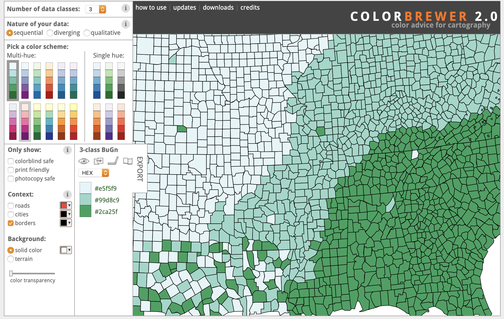

```{r include=FALSE}
knitr::opts_chunk$set(echo = TRUE, message = FALSE, warning = FALSE,
                      comment = "#>", highlight = TRUE,
                      fig.align = "center")
```

## Supplementary materials

Full video lecture available in Zoom Cloud Recordings

Additional resources

- [Chapter 3](https://r4ds.had.co.nz/data-visualisation.html), R for Data Science
- `ggplot2` [Reference](https://ggplot2.tidyverse.org/reference/index.html)
- `ggplot2` [cheat sheet](https://github.com/rstudio/cheatsheets/raw/master/data-visualization-2.1.pdf)
- [color brewer 2](http://colorbrewer2.org/)


---

## `ggplot2`

- `ggplot2` is a plotting system for R, based on the grammar of graphics

  - using the good parts of base and lattice 

- It takes care of many of the fiddly details that make plotting a hassle 
  
  - such as drawing legends and faceting
  - particularly helpful for plotting multivariate data
  
Package `ggplot2` is available in package `tidyverse`. Let's load that now.

```{r message=FALSE}
library(tidyverse)
```

---

## The Grammar of Graphics

- Visualization concept created by Leland Wilkinson (1999)
    - to define the basic elements of a statistical graphic 

- Adapted for R by Wickham (2009)
    - consistent and compact syntax to describe statistical graphics
    - highly modular as it breaks up graphs into semantic components 

- It is not meant as a guide to which graph to use and how to best convey your 
  data (more on that later).


---

## Today's data: MLB

```{r}
teams <- read_csv("http://www2.stat.duke.edu/~sms185/data/mlb/teams.csv")
```

Object `teams` is a data frame that contains yearly statistics and standings
for MLB teams from 2009 to 2018.

The data has `r nrow(teams)` rows and `r ncol(teams)` variables.

---

.tiny[
```{r}
teams
```
]

---

class: inverse, center, middle

# Plot comparison

---

## Using `ggplot()`

```{r echo=FALSE, fig.width=10}
ggplot(teams, mapping = aes(x = R - RA, y = WinPct, color = DivWin)) +
  geom_point() +
  geom_smooth(method = "lm", se = FALSE) +
  labs(y = "Win Percentage", x = "Run Differential")
```

---

## Using `plot()`

```{r echo=FALSE, fig.width=10}
teams$RD <- teams$R - teams$RA
teams_div <- teams[teams$DivWin == "Y", ]
teams_no_div <- teams[teams$DivWin == "N", ]

mod1 <- lm(WinPct ~ RD, data = teams_div)
mod2 <- lm(WinPct ~ RD, data = teams_no_div)

plot(x = (teams$R - teams$RA), y = teams$WinPct,
     col = adjustcolor(as.integer(factor(teams$DivWin))),
     pch = 16, 
     xlab = "Run Differential",
     ylab = "Win Percentage")
abline(mod1, col = 2, lwd=2)
abline(mod2, col = 1, lwd=2)


```

---

## Code comparison

Using `ggplot()`

```{r eval=FALSE}
ggplot(teams, mapping = aes(x = R - RA, y = WinPct, color = DivWin)) +
  geom_point() +
  geom_smooth(method = "lm", se = FALSE) +
  labs(x = "Win Percentage", y = "Run Differential")
```

--

Using `plot()`

```{r eval=FALSE}
teams$RD <- teams$R - teams$RA
teams_div <- teams[teams$DivWin == "Y", ]
teams_no_div <- teams[teams$DivWin == "N", ]

mod1 <- lm(WinPct ~ RD, data = teams_div)
mod2 <- lm(WinPct ~ RD, data = teams_no_div)

plot(x = (teams$R - teams$RA), y = teams$WinPct,
     col = adjustcolor(as.integer(factor(teams$DivWin))),
     pch = 16, 
     xlab = "Run Differential",
     ylab = "Win Percentage")
abline(mod1, col = 2, lwd=2)
abline(mod2, col = 1, lwd=2)
```

---

class: inverse, center, middle

# What's in a `ggplot()`?

---

## Terminology

A statistical graphic is a...

- mapping of **data**

- which may be **statistically transformed** (summarized, log-transformed, etc.)

- to **aesthetic attributes** (color, size, xy-position, etc.)

- using **geometric objects** (points, lines, bars, etc.)

- and mapped onto a specific **facet** and **coordinate system.**

---

## What do I "need"?

1) Some data (preferably in a data frame)

```{r echo=TRUE, fig.width=10, fig.height=6}
ggplot(data = teams) #<<
```

---

2) A set of variable mappings

```{r echo=TRUE, fig.width=10, fig.height=6}
ggplot(data = teams, mapping = aes(x = attendance / 1000, y = W)) #<<
```

---

3) A geom with arguments, or multiple geoms with arguments connected by `+`

```{r echo=TRUE, fig.width=10, fig.height=6}
ggplot(data = teams, mapping = aes(x = attendance / 1000, y = W)) +
  geom_point(color = "blue") #<<
```

---

4) Some options on changing scales or adding facets

```{r echo=TRUE, fig.width=10, fig.height=6}
ggplot(data = teams, mapping = aes(x = attendance / 1000, y = W)) +
  geom_point(color = "blue") +
  facet_wrap(~yearID, nrow = 2) #<<
  
```

---

5) Some labels

```{r echo=TRUE, fig.width=10, fig.height=6}
ggplot(data = teams, mapping = aes(x = attendance / 1000, y = W)) +
  geom_point(color = "blue") +
  facet_wrap(~yearID, nrow = 2) +
  labs(x = "Attendance", y = "Wins", caption = "Attendance in thousands") #<<
```

---

6) Other options

```{r echo=TRUE, fig.width=10, fig.height=6}
ggplot(data = teams, mapping = aes(x = attendance / 1000, y = W)) +
  geom_point(color = "blue") +
  facet_wrap(~yearID, nrow = 2) +
  labs(x = "Attendance", y = "Wins", caption = "Attendance in thousands") +
  theme_bw(base_size = 16) + #<<
  theme(axis.text.x = element_text(angle = 45, hjust = 1)) #<<
  
```

---

## Anatomy of a ggplot

```{r eval=FALSE}
ggplot(
  data = [dataframe],
  
  aes(
    x = [var_x], y = [var_y], 
    color = [var_for_color], 
    fill  = [var_for_fill], 
    shape = [var_for_shape],
    size  = [var_for_size],
    alpha = [var_for_alpha],
    ...#other aesthetics
  )
) +
  geom_<some_geom>([geom_arguments]) +
  ... # other geoms
  scale_<some_axis>_<some_scale>() +
  facet_<some_facet>([formula]) +
  ... # other options
```

To visualize multivariate relationships we can add variables to our 
visualization by specifying aesthetics: color, size, shape, linetype, 
alpha, or fill; we can also add facets based on variable levels.

---

class: inverse, center, middle

# Scatter plots

---

## Base plot

.tiny[
```{r fig.align='center', fig.width=9, fig.height=6}
ggplot(data = teams, mapping = aes(x = (R ^ 2 / (R ^ 2 + RA ^2 )), y = WinPct)) +
  geom_point() #<<
```
]

---

## Altering aesthetic color

.tiny[
```{r fig.align='center', fig.width=9, fig.height=6}
ggplot(data = teams, mapping = aes(x = (R ^ 2 / (R ^ 2 + RA ^2 )), y = WinPct)) +
  geom_point(color = "#E81828") #<<
```
]

---

## Altering aesthetic color

.tiny[
```{r fig.align='center', fig.width=9, fig.height=6}
ggplot(data = teams, mapping = aes(x = (R ^ 2 / (R ^ 2 + RA ^2 )), y = WinPct, color = lgID)) + #<<
  geom_point(show.legend = FALSE)
```
]

---

## Altering aesthetic color

.tiny[
```{r fig.align='center', fig.width=9, fig.height=6}
ggplot(data = teams, mapping = aes(x = (R ^ 2 / (R ^ 2 + RA ^2 )), y = WinPct, color = lgID)) +
  geom_point() #<<
```
]

---

## Base plot

.tiny[
```{r fig.align='center', fig.width=9, fig.height=6}
ggplot(data = teams[teams$yearID == 2018, ], mapping = aes(x = BB + H, y = SO)) +
  geom_point()
```
]

---

## Altering multiple aesthetics

.tiny[
```{r fig.align='center', fig.width=9, fig.height=6}
ggplot(data = teams[teams$yearID == 2018, ], mapping = aes(x = BB + H, y = SO)) +
  geom_point(size = 3, shape = 2, color = "#E81828") #<<
```
]

---

## Altering multiple aesthetics

.tiny[
```{r fig.align='center', fig.width=9, fig.height=6}
ggplot(data = teams[teams$yearID == 2018, ], mapping = aes(x = BB + H, y = SO, 
                     color = factor(Rank), shape = factor(Rank))) + #<<
  geom_point(size = 4, alpha = .8, show.legend = FALSE)
```
]

---

## Altering multiple aesthetics

.tiny[
```{r fig.align='center', fig.width=9, fig.height=6}
ggplot(data = teams[teams$yearID == 2018, ], mapping = aes(x = BB + H, y = SO, 
                     color = factor(Rank), shape = factor(Rank))) + #<<
  geom_point(size = 4, alpha = .8)
```
]

---

## Inside or outside `aes()`?

When does an aesthetic go inside function `aes()`?

- If you want an aesthetic to be reflective of a variable's values, it must
  go inside aes.

- If you want to set an aesthetic manually and not have it convey
  information about a variable, use the aesthetic's name outside of aes
  and set it to your desired value.
  

Aesthetics for continuous and discrete variables are measured on
continuous and discrete scales, respectively.

---

## Faceting

.tiny[
```{r fig.align='center', fig.width=9, fig.height=6}
ggplot(data = teams, mapping = aes(x = R, y = WinPct, color = DivWin)) +
  geom_point(alpha = .8) +
  facet_grid(lgID~ .) #<<
```
]

---

## Faceting

.tiny[
```{r fig.align='center', fig.width=9, fig.height=6}
ggplot(data = teams, mapping = aes(x = R, y = WinPct, color = DivWin)) +
  geom_point(alpha = .8) +
  facet_grid(. ~lgID) #<<
```
]

---

## Faceting

.tiny[
```{r fig.align='center', fig.width=9, fig.height=6}
ggplot(data = teams, mapping = aes(x = R, y = WinPct, color = DivWin)) +
  geom_point(alpha = .8) +
  facet_grid(divID~lgID) #<<
```
]

---

## Faceting

.tiny[
```{r fig.align='center', fig.width=9, fig.height=6}
ggplot(data = teams, mapping = aes(x = R, y = WinPct, color = DivWin)) +
  geom_point(alpha = .8) +
  facet_wrap(~yearID) #<<
```
]

---

## Facet grid or wrap?

- Use `facet_wrap()` to wrap a one dimensional sequence into two dimensional
  panels.
  
- Use `facet_grid()` when you have two discrete variables and you want panels
  of plots to represent all possible combinations.
  
---

## Exercise

Let's explore the relationship between runs and strikeouts for division
winners and non-division winners. 
Use tibble `teams` to re-create the plot below.

```{r echo=FALSE, fig.align='center', fig.width=12, fig.height=6}
ggplot(data = teams, mapping = aes(x = SO, y = R, color = factor(DivWin))) +
  geom_point(size = 3, alpha = .8) +
  facet_wrap(~yearID, nrow = 2) +
  labs(x = "Strike outs", y = "Runs", color = "Division winner")
```

<br/>

**How can we improve this visualization?**

???

.tiny[
```{r eval=FALSE}
ggplot(data = teams, mapping = aes(x = SO, y = R, color = factor(DivWin))) +
  geom_point(size = 3, alpha = .8) +
  facet_wrap(~yearID, nrow = 2) +
  labs(x = "Strike outs", y = "Runs", color = "Division winner")
```
]

---

## A more effective visualization

```{r echo=FALSE, fig.align='center', fig.width=12, fig.height=8}
ggplot(data = teams, mapping = aes(x = SO, y = R, color = factor(DivWin))) +
  geom_point(size = 2, alpha = .8) +
  geom_hline(yintercept = 750, lty = 2, alpha = .5, color = "blue") +
  geom_vline(xintercept = 1250, lty = 2, alpha = .5, color = "blue") +
  facet_wrap(~yearID, nrow = 2) +
  labs(x = "Strike outs", y = "Runs", color = "Division winner",
       title = "Division winners generally score more runs",
       subtitle = "and have fewer strike outs") +
  scale_color_manual(values = c("grey", "red")) +
  scale_x_continuous(limits = c(750, 1750), breaks = seq(900, 1700, 350),
                     labels = seq(900, 1700, 350)) +
  scale_y_continuous(limits = c(500, 1000), breaks = seq(500, 1000, 100),
                     labels = seq(500, 1000, 100)) +
  theme_bw(base_size = 16) +
  theme(legend.position = "bottom")
```

???

```{r eval=FALSE, fig.align='center', fig.width=12, fig.height=8}
ggplot(data = teams, mapping = aes(x = SO, y = R, color = factor(DivWin))) +
  geom_point(size = 2, alpha = .8) +
  geom_hline(yintercept = 750, lty = 2, alpha = .5, color = "blue") +
  geom_vline(xintercept = 1250, lty = 2, alpha = .5, color = "blue") +
  facet_wrap(~yearID, nrow = 2) +
  labs(x = "Strike outs", y = "Runs", color = "Division winner",
       title = "Division winners generally score more runs",
       subtitle = "and have fewer strike outs") +
  scale_color_manual(values = c("grey", "red")) +
  scale_x_continuous(limits = c(750, 1750), breaks = seq(900, 1700, 350),
                     labels = seq(900, 1700, 350)) +
  scale_y_continuous(limits = c(500, 1000), breaks = seq(500, 1000, 100),
                     labels = seq(500, 1000, 100)) +
  theme_bw(base_size = 16) +
  theme(legend.position = "bottom")
```

---

class: inverse, center, middle

# Other geoms

---

## Caution

- The following plots are not well-polished. They are designed to demonstrate
  the various geoms and options that exist within `ggplot2`.
  
- You should always have a well-labelled and polished visualization if it will
  be seen by an outside audience.

---

## Box plots

.tiny[
```{r fig.align='center', fig.width=9, fig.height=6}
ggplot(teams, mapping = aes(x = factor(yearID), y = kpg)) +
  geom_boxplot(color = "#E81828", fill = "#002D72", alpha = .7) #<<
```
]

---

## Box plots: flipped coordinates

.tiny[
```{r fig.align='center', fig.width=9, fig.height=6}
ggplot(teams, mapping = aes(x = factor(yearID), y = kpg)) +
  geom_boxplot(color = "#E81828", fill = "#002D72", alpha = .7) +
  coord_flip() #<<
```
]

---

## Box plots: custom colors

.tiny[
```{r fig.align='center', fig.width=9, fig.height=5}
ggplot(teams, mapping = aes(x = factor(yearID), y = kpg, fill = lgID)) +
  geom_boxplot(color = "grey", alpha = .7) +
  scale_fill_manual(values = c("#E81828", "#002D72")) + #<<
  coord_flip() +
  theme_bw() #<<
```
]

---

## Bar plots

.tiny[
```{r fig.align='center', fig.width=9, fig.height=6}
ggplot(teams[teams$yearID == 2018, ], mapping = aes(y = W, x = franchID)) +
  geom_bar(stat = "identity")
```
]

---

## Bar plots: angled text

.tiny[
```{r fig.align='center', fig.width=9, fig.height=6}
ggplot(teams[teams$yearID == 2018, ], mapping = aes(y = W, x = franchID)) +
  geom_bar(stat = "identity") +
  theme(axis.text.x = element_text(angle = 45, hjust = 1)) #<<
```
]

---

## Bar plots: sorted

.tiny[
```{r fig.align='center', fig.width=9, fig.height=6}
ggplot(teams[teams$yearID == 2018, ], mapping = aes(y = W, x = reorder(franchID, -W))) + #<<
  geom_bar(stat = "identity", color = "#E81828", fill = "#002D72", alpha = .7) +
  theme(axis.text.x = element_text(angle = 45, hjust = 1))
```
]

---

## Bar plots: granular scale

.tiny[
```{r fig.align='center', fig.width=9, fig.height=5}
ggplot(teams[teams$yearID == 2018, ], mapping = aes(y = W, x = reorder(franchID, -W))) +
  geom_bar(stat = "identity", color = "#E81828", fill = "#002D72", alpha = .7) +
  scale_y_continuous(breaks = seq(0, 120, 15), labels = seq(0, 120, 15), limits = c(0, 120)) + #<<
  theme(axis.text.x = element_text(angle = 45, hjust = 1))
```
]

---

## Histograms

.tiny[
```{r fig.align='center', fig.width=9, fig.height=6}
ggplot(teams, mapping = aes(x = WinPct)) +
  geom_histogram(binwidth = .025, fill = "#E81828", color = "#002D72", alpha = .7)
```
]

---

## Density plots

.tiny[
```{r fig.align='center', fig.width=9, fig.height=6}
ggplot(teams, mapping = aes(x = WinPct)) +
  geom_density(fill = "#E81828", color = "#002D72", alpha = .7)
```
]

---

## Density plots: custom colors

.tiny[
```{r fig.align='center', fig.width=9, fig.height=6}
ggplot(teams, mapping = aes(x = WinPct, fill = lgID)) +
  geom_density(alpha = .5) +
  scale_fill_manual(values = c("#E81828", "#002D72")) #<<
```
]

---

## Heat maps

.tiny[
```{r fig.align='center', fig.width=9, fig.height=6}
ggplot(teams[teams$yearID == 2018, ], mapping = aes(x = Rank, y = divID, fill = RD)) +
  geom_raster() #<<
```
]

---

## Heat maps: color palette

.tiny[
```{r fig.align='center', fig.width=9, fig.height=6}
ggplot(teams[teams$yearID == 2018, ], mapping = aes(x = Rank, y = divID, fill = RD)) +
  geom_raster() +
  scale_fill_gradientn(colours = terrain.colors(10)) #<<
```
]

---

## Heat maps: color palette

.tiny[
```{r fig.align='center', fig.width=9, fig.height=6}
ggplot(teams[teams$yearID == 2018, ], mapping = aes(x = Rank, y = divID, fill = RD)) +
  geom_raster() +
  scale_fill_gradient(low = "#fef0d9", high = "#b30000") #<<
```
]

---

## Choosing colors

[Color Brewer 2](http://colorbrewer2.org/)



---

## Effective visualization tips
  
- Provide a title that tells a story.
  
- Strive to have your visualization function in a closed environment.

- Be mindful of color and scale choices.

- Generally, color is better than shape to make things "pop".

- Not everything has to have a color, shape, transparency, etc.

- Add labels and annotation.

- Use your visualization to support your story.

- Use chunk options `fig.width`, `fig.height`, `fig.align`, and `fig.show` to 
  manipulate your plot's size and placement.

---


class: inverse, center, middle

# Exercise

---

## Energy data

.tiny[
```{r}
energy <- read_csv("http://www2.stat.duke.edu/~sms185/data/energy/energy.csv")
```
]

.tiny[
```{r}
energy
```
]

---

## Data dictionary

The power sources represent the amount of energy a power source generates
each day as represented in daily MWh.

- `MWhperDay`: MWh of energy generated per day
- `name`: energy source name
- `type`: type of energy source
- `location`: country of energy source
- `note`: more details on energy source
- `boe`: barrel of oil equivalent

<br>

- **Daily megawatt hour (MWh)** is a measure of energy output.
- **1 MWh** is, on average, enough power for 28 people in the USA

---

## Objective

Re-create the plot on the following slide.

A few notes:

- base font size is 18

- hex colors: `c("#9d8b7e", "#315a70", "#66344c", "#678b93", "#b5cfe1", "#ffcccc")`

- use function `order()` to help get the top 30

Starter code:

```{r eval=FALSE}
energy_top_30 <- energy[order(energy$MWhperDay, decreasing = T)[1:30], ]
```


---

```{r echo=FALSE, fig.align='center', fig.width=12, fig.height=10}
energy_top_30 <- energy[order(energy$MWhperDay, decreasing = T)[1:30], ]

ggplot(energy_top_30, mapping = aes(x = reorder(name, MWhperDay), 
                                    y = MWhperDay / 1000, 
                                    fill = type)) +
  geom_bar(stat = "identity") +
  scale_fill_manual(values = c("#9d8b7e", "#315a70", "#66344c",
                               "#678b93", "#b5cfe1", "#ffcccc")) +
  theme_bw(base_size = 18) +
  labs(y       = "Daily MWh (in thousands)", x = "Power Source",
       title   = "Top 30 power source energy generators",
       fill    = "Power Source",
       caption = "1 MWh is, on average, enough power for 28 people in the USA") +
  coord_flip()
```

???

.tiny[
```{r eval=FALSE}
ggplot(energy_top_30, mapping = aes(x = reorder(name, MWhperDay), 
                                    y = MWhperDay / 1000, 
                                    fill = type)) +
  geom_bar(stat = "identity") +
  scale_fill_manual(values = c("#9d8b7e", "#315a70", "#66344c",
                               "#678b93", "#b5cfe1", "#ffcccc")) +
  theme_bw(base_size = 18) +
  labs(y       = "Daily MWh (in thousands)", x = "Power Source",
       title   = "Top 30 power source energy generators",
       fill    = "Power Source",
       caption = "1 MWh is, on average, enough power for 28 people in the USA") +
  coord_flip()
```
]

---

## References

1. Grolemund, G., & Wickham, H. (2019). R for Data Science. R4ds.had.co.nz.
   https://r4ds.had.co.nz/data-visualisation.html

2. https://ggplot2.tidyverse.org/reference/

3. Lahman, S. (2019) Lahman's Baseball Database, 1871-2018, Main page,
   http://www.seanlahman.com/baseball-archive/statistics/
  
4. https://www.visualcapitalist.com/worlds-largest-energy-sources/


