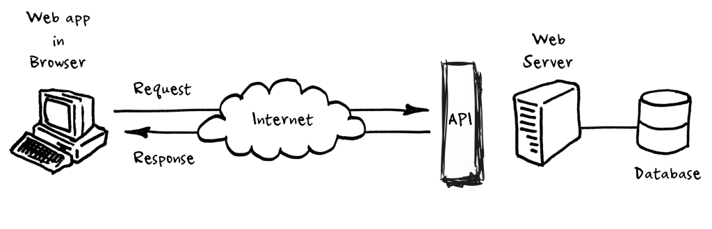

```{r include=FALSE}
knitr::opts_chunk$set(echo = TRUE, message = FALSE, warning = FALSE,
                      comment = "#>", highlight = TRUE,
                      fig.align = "center")
```

## Supplementary materials

Full video lecture available in Zoom Cloud Recordings

Additional resources

- [HTTP tutorial](https://code.tutsplus.com/tutorials/http-the-protocol-every-web-developer-must-know-part-1--net-31177)
- `httr` [vignette](https://cran.r-project.org/web/packages/httr/vignettes/quickstart.html)
- [Public APIs](https://github.com/public-apis/public-apis)

---

class: inverse, center, middle

# Introduction

---

## Application Programming Interface

An API is a messenger that takes requests and returns responses. It allows for 
interaction between applications, databases, and devices.

--
<br/>

If you want to

- embed a map on your website, you'll probably use Google's API

- embed a tweet on your website, you'll probably use Twitter's API

- trade stocks in Python or R, you'll probably use your broker's API

- create 33 repositories named exam1-[github_name], you'll probably use
  GitHub's API
  
<br/>
  
There are [thousands of APIs](https://www.programmableweb.com/apis/directory)
that exist. Most are integrated in a client-server framework.

---

## Old framework

Requests return HTML pages that are relatively easy to scrape. 


*Source*: http://www.robert-drummond.com/2013/05/08/how-to-build-a-restful-web-api-on-a-raspberry-pi-in-javascript-2/

---

## Client-server framework with an API

The API facilitates communication between the web app and server/database.



*Source*: http://www.robert-drummond.com/2013/05/08/how-to-build-a-restful-web-api-on-a-raspberry-pi-in-javascript-2/

---

class: inverse, center, middle

# Protocols

---

## Protocols

A computer protocol is a set of rules that govern how multiple computers
communicate.

- IP: Internet Protocol

- FTP: File Transfer Protocol

- HTTP: Hyper Text Transfer Protocol
    - The key protocol that governs data transfer over the internet
    - Allows HTML, CSS, JS to be transferred from a server to your browser

- HTTPS: Hyper Text Transfer Protocol Secure

--
<br/><br/>

Why do we care?

**Web APIs are built on HTTP**. Since so much of what we do is built over the 
web it is natural for web APIs to follow this protocol.

---

## HTTP requests

.pull-left[

A client makes a request and includes

- a uniform resource locator (URL)
    - `https://stat.duke.edu/`
    
- a method
    - GET, POST, PUT, DELETE, ...
    
- headers
    - meta-information about the request
    
- a body
    - possible data to send to the server

]

.pull-right[
<br/><br/><br/><br/>


<br/><br/>
*Source*: https://zapier.com/learn/apis/

]

---

## HTTP request, a closer look

URL and method

```http
Request URL: https://stat.duke.edu/
Request Method: GET
```
--

Headers

```http
Accept: text/html,application/xhtml+xml,application/xml;q=0.9,image/avif,image/webp,image/apng,*/*;q=0.8,application/signed-exchange;v=b3;q=0.9
Accept-Encoding: gzip, deflate, br
Accept-Language: en-US,en;q=0.9
Cache-Control: max-age=0
Connection: keep-alive
Cookie: _ga=GA1.2.1417829868.1601583943; _gid=GA1.2.1516354824.1601583943; _gat_gtag_UA_8078579_35=1
Host: stat.duke.edu
If-None-Match: "1601583940"
Sec-Fetch-Dest: document
Sec-Fetch-Mode: navigate
Sec-Fetch-Site: none
Sec-Fetch-User: ?1
Upgrade-Insecure-Requests: 1
User-Agent: Mozilla/5.0 (Macintosh; Intel Mac OS X 10_15_7) AppleWebKit/537.36 (KHTML, like Gecko) Chrome/85.0.4183.121 Safari/537.36
```

---

## HTTP responses

.pull-left[
A server response includes

- a three-digit status code
    - 1xx indicates an informational message only
    - 2xx indicates success of some kind
    - 3xx redirects the client to another URL
    - 4xx indicates an error on the client's part
    - 5xx indicates an error on the server's part

- headers
    - meta-information about the response
    
- a body
    - data from the server
]

.pull-right[
<br/><br/><br/><br/>


<br/><br/>
*Source*: https://zapier.com/learn/apis/

]

---

## HTTP response, a closer look

Status code

```http
Status Code: 200 OK
```
--

Headers

```http
Cache-Control: max-age=1800, public
Connection: Keep-Alive
Content-language: en
Content-Type: text/html; charset=UTF-8
Date: Thu, 01 Oct 2020 20:25:53 GMT
ETag: "1601583940"
Expires: Sun, 19 Nov 1978 05:00:00 GMT
Keep-Alive: timeout=5, max=87
Last-Modified: Thu, 01 Oct 2020 20:25:40 GMT
Link: <https://stat.duke.edu/>; rel="shortlink", <https://stat.duke.edu/>; rel="canonical"
Link: <https://stat.duke.edu/front>; rel="revision"
Server: Apache
      ⋮
X-Frame-Options: SAMEORIGIN
X-Generator: Drupal 8 (https://www.drupal.org)
X-UA-Compatible: IE=edge
```

---

## Example with package `httr`

```{r}
library(httr)

resp <- GET("https://stat.duke.edu")
str(resp, max.level = 1)
```

---

```{r}
content(resp, "parsed")
```

<br/><br/>

If you are unable to scrape data with `rvest`, package `httr` is a great
alternative before using `RSelenium`.

---

class: inverse, center, middle

# More on web APIs

---

## RESTful APIs

**RE**presentational **S**tate **T**ransfer 

- describes an architectural style for web services (not a standard)
    - 6 guiding principles (constraints)

- all communication via http requests

- a REST API should specify what it can provide and how to use it, details such as query parameters, response format, request limitations, public use/API keys, method (GET/POST/PUT/DELETE), language support, etc

---

## Methods

- GET - fetch a resource

- POST - create a new resource

- PUT - update a resource

- DELETE - delete a resource

<br/>

Less common verbs: HEAD, TRACE, OPTIONS

---

## More on URLs


*Source*: [HTTP: The Protocol Every Web Developer Must Know](http://code.tutsplus.com/tutorials/http-the-protocol-every-web-developer-must-know-part-1--net-31177)

<br/>

- also for `https`

- default port is 80 for `http` and 443 for `https`, typically not displayed

- resource path is the local path to the resource on the server

Examples:

- `https://api.openbrewerydb.org/breweries`

- `https://api.openbrewerydb.org/breweries?by_state=new+york`

---

## Query strings

Provides named parameter(s) and value(s) that modify the behavior of the resulting page. 

<br/>

Format generally follows:

<br/>

<center>
field1=value1&field2=value2&field3=value3
</center>

--

<br/>

Some quick examples,

* `https://api.petfinder.com/v2/animals?type=dog&page=2`

* `https://app.ticketmaster.com/discovery/v2/events.json?attractionId=K8vZ917Gku7&countryCode=CA&apikey=RpD2faqwk2uio290`


---

## URL encoding

This will often be handled automatically by your web browser or other tool, 
but it is useful to know a bit about what is happening.

- Spaces will encoded as '+' or '%20'.
    - `https://api.openbrewerydb.org/breweries?by_state=new+york`

- Certain characters are reserved and will be replaced with the percent-encoded 
  version within a URL.

.small[

| !   | #   | $   | &   | '   | (   | )   |
|:---:|:---:|:---:|:---:|:---:|:---:|:---:|
| %21 | %23 | %24 | %26 | %27 | %28 | %29 |
| *   | +   | ,   | /   | :   | ;   | =   |
| %2A | %2B | %2C | %2F | %3A | %3B | %3D |
| ?   | @   | [   | ]   |
| %3F | %40 | %5B | %5D |

]

- Characters that cannot be converted are replaced with HTML numeric character references (e.g. a &#931; would be encoded as &amp;#931; )

---


```{r}
URLencode("https://api.openbrewerydb.org/breweries?by_state=new york")
URLdecode("https://api.openbrewerydb.org/breweries?by_state=new%20york")
```


--


```{r}
URLencode("!#$&'()*+,/]", reserved = TRUE)
URLdecode(URLencode("!#$&'()*+,/]", reserved = TRUE))
```


--


```{r}
URLencode("Σ")
URLdecode("%CE%A3")
```


---

## JSON: JavaScript Object Notation

When exchanging data between a browser and a server, the data can only be text.
JSON is the typical format and it is conveniently structured to be human and 
machine readable.

- R package `jsonlite` has some functions that will make it easy to get JSON
  data into a workable form in R.
  
- `read_json()` - read in JSON data as a list

- `fromJSON()` - read in JSON trying to simplify it to a data frame

<br/>

To preview JSON data in your browser, check out 
https://codebeautify.org/jsonviewer

---

## Exercise

Use the [Open Brewery API](https://www.openbrewerydb.org/) to answer the 
following questions.

1. How many breweries are located in Durham, NC?

2. Which city in North Carolina has the most micro breweries? How many micro
   breweries do they have?

3. In what cities are Founders, Yuengling, and Boulevard brewed?

???

## Solutions

```{r}
library(jsonlite)
library(tidyverse)
base_url <- "https://api.openbrewerydb.org/breweries"

# question 1
query1 <- "?by_state=north+carolina&by_city=durham&per_page=50"
read_json(str_c(base_url, query1)) %>% 
  length()

# question 2
get_nc_brew <- function(base, page) {
  query <- str_c("?by_state=north_carolina&by_type=micro&page=", 
                 page, "&per_page=50")
  fromJSON(str_c(base_url, query))
}

nc_micro <- map(1:10, get_nc_brew, base = base_url) %>% 
  map_df(rbind) %>% 
  as_tibble()

nc_micro %>% 
  group_by(city) %>% 
  summarise(count = n()) %>% 
  arrange(desc(count)) %>% 
  slice(1)

# question 3
brew <- c("founders", "yuengling", "boulevard")

get_city_brew <- function(co) {
  query3 <- str_c("?by_name=", co)
  fromJSON(str_c(base_url, query3)) %>% 
  pull(city) %>% 
  unique()
}

map(brew, get_city_brew) %>% 
  set_names(brew)
```

---

## References

1. An Introduction to APIs. (2020). https://zapier.com/learn/apis/

2. Podila, P. (2013). HTTP: The Protocol Every Web Developer Must Know - Part 1. 
   https://code.tutsplus.com/tutorials/http-the-protocol-every-web-developer-must-know-part-1--net-31177

3. Tools for Working with URLs and HTTP. (2020). 
   https://httr.r-lib.org////index.html


