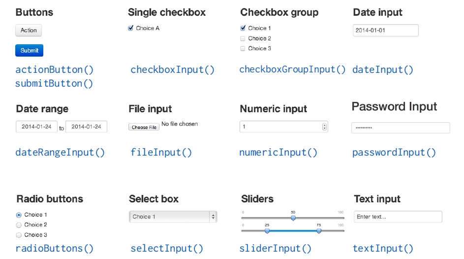
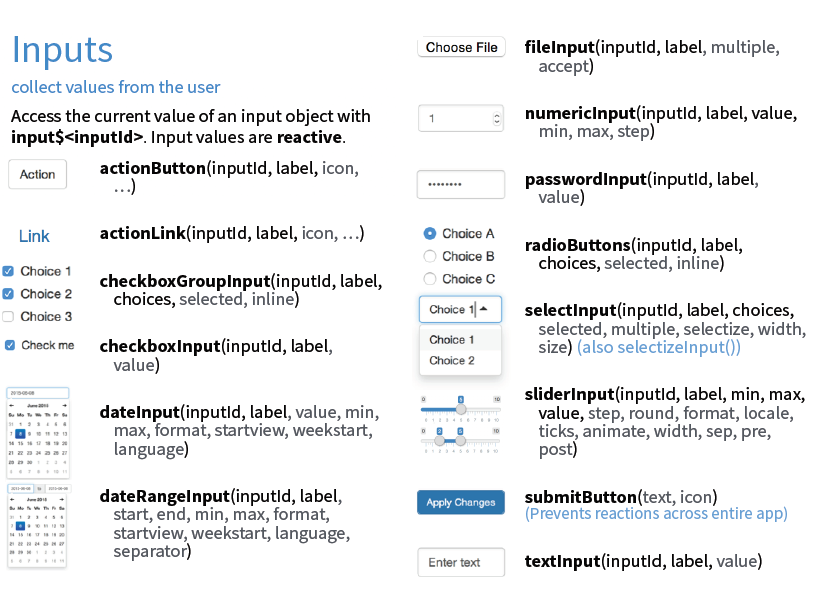
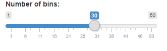
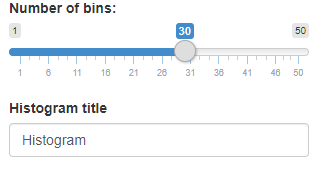
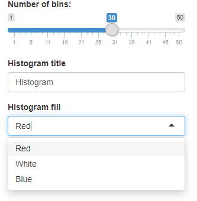
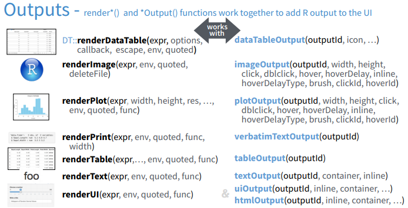
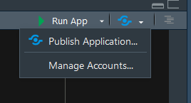

```{r include=FALSE}
knitr::opts_chunk$set(echo = TRUE, message = FALSE, warning = FALSE,
                      comment = "#>", highlight = TRUE,
                      fig.align = "center")
```

## Supplementary materials

Full video lecture available in Zoom Cloud Recordings

Additional resources

- Shiny [documentation](http://shiny.rstudio.com/)
- Shiny [Widgets Gallery](http://shiny.rstudio.com/gallery/widget-gallery.html)
- Shiny [Cheat Sheet](https://github.com/rstudio/cheatsheets/raw/master/shiny.pdf)

---

## What is Shiny?

.pull-left[
- Shiny is an R package.
<br/><br/>
- Build web-based apps with R in RStudio.
<br/><br/>
- Shiny can incorporate CSS themes and JavaScript actions.

]

.pull-right[

]

---

## How does Shiny work?


---

## How does Shiny work?


---

## How does Shiny work?


---

## Getting started

- Open RStudio

- Run `install.packages("shiny")`, if needed

- Go to File `>` New File `>` Shiny Web App

- Enter your application's name

- Keep option Single File (app.R) selected

- Enter the directory of where the application should be saved

- File `app.R` should open, click Run App to see the result

```{r echo=FALSE}
library(shiny)
```

---

## Main components of RShiny

.pull-left[

```{r eval=FALSE}
 # Load package shiny
library(shiny)
# Define UI for application
ui <- fluidPage(
  
  
)

# Define server logic
server <- function(input, output) {
  
  
}

# Build and run the application
shinyApp(ui = ui, server = server)
```

]

.pull-right[
- Function `fluidPage()` creates a dynamic HTML user interface you see when you 
  look at an RShiny app. Convention is to save this as an object named `ui`.
  
- Function `server()` is user-defined and contains R commands your computer 
  or external server need to run the app.
  
- Function `shinyApp()` builds the app based on the user interface and 
  server pair of code.
]

---

## Available examples

Enter any of the following in your Console to see the Shiny app in action 
along with the code.

```{r eval=FALSE}
runExample("01_hello")        # a histogram
runExample("02_text")         # tables and data frames
runExample("03_reactivity")   # a reactive expression
runExample("04_mpg")          # global variables
runExample("05_sliders")      # slider bars
runExample("06_tabsets")      # tabbed panels
runExample("07_widgets")      # help text and submit buttons
runExample("08_html")         # Shiny app built from HTML
runExample("09_upload")       # file upload wizard
runExample("10_download")     # file download wizard
runExample("11_timer")        # an automated timer
```

---

class: inverse, center, middle

# User interface

---


class: inverse, center, middle

# User interface: inputs

---

## Input widgets



---



---

## Adding an input widget

Most input widgets are set-up as `*Input(inputId, label, ...)` or
`*Button(inputId, label, ...)`, where * is replaced with the widget's name.


For example, to create a slider widget we can write

```{r eval=FALSE}
sliderInput(inputId = "bins", label = "Number of bins:", 
            min = 1, max = 50, value = 30)
```

<br/><br/>

Typically, the first two widget function argument names are not specified 
since most widgets first take an `inputId` and `label`. Argument `inputId` is
where you specify a name for the widget (this is not seen by the user); argument 
`label` is the label that will appear in your app 
(this will be seen by the user).

---

## What do these widget functions return?

```{r eval=FALSE}
sliderInput(inputId = "bins", label = "Number of bins:", 
            min = 1, max = 50, value = 30)
```

<br/><br/>

```html
<div class="form-group shiny-input-container">
  <label class="control-label" for="bins">Number of bins:</label>
  <input class="js-range-slider" id="bins" data-min="1" data-max="50" data-from="30" data-step="1" data-grid="true" data-grid-num="9.8" data-grid-snap="false" data-prettify-separator="," data-prettify-enabled="true" data-keyboard="true" data-data-type="number"/>
</div>
```

<br/><br/>

Some HTML!

---

## Assortment of input widgets

.pull-left[
.tiny[
```{r eval=FALSE}
ui <- fluidPage(
  # add slider
  sliderInput("bins", "Number of bins:",
              min = 1, max = 50, value = 30)
)

server <- function(input, output) {
  
}

shinyApp(ui = ui, server = server)
```
]
]

.pull-right[



]

---

## Assortment of input widgets

.pull-left[
.tiny[
```{r eval=FALSE}
ui <- fluidPage(
  # add slider
  sliderInput("bins", "Number of bins:",
              min = 1, max = 50, value = 30),
  # text box input
  textInput("title", "Histogram title", 
            value = "Histogram")
)

server <- function(input, output) {
  
}

shinyApp(ui = ui, server = server)
```
]
]

.pull-right[



]

---

## Assortment of input widgets

.pull-left[
.tiny[
```{r eval=FALSE}
ui <- fluidPage(
  # add slider
  sliderInput("bins", "Number of bins:",
              min = 1, max = 50, value = 30),
  # text box input
  textInput("title", "Histogram title", 
            value = "Histogram"),
  # combo box
  selectInput("color", "Histogram fill",
              choices = c("Red", "White", "Blue"),
              selected = "Red")
)

server <- function(input, output) {
  
}

shinyApp(ui = ui, server = server)
```
]
]

.pull-right[



]

--

Continue to add as many additional widgets as you want/need.

---

class: inverse, center, middle

# User interface: outputs

---

## Output functions

Inputs are added with `*Input()`. Similarly, outputs in Shiny are added with
`*Output()`.

|     Output function    |   Creates  |
|:----------------------:|:----------:|
| `dataTableOutput()`    | data table |
| `htmlOutput()`         | raw HTML   |
| `imageOutput()`        | image      |
| `plotOutput()`         | plot       |
| `tableOutput()`        | table      |
| `textOutput()`         | text       |
| `uiOutput()`           | raw HTML   |
| `verbatimTextOutput()` | text       |

---

## Output function details



<br/>

The first argument for each output function is `outputId`. This argument
is where you specify a name for the output (this is not seen by the user). This
name will serve as reference for code in function `server()`.

---

## Output function

.pull-left[
.tiny[
```{r eval=FALSE}
ui <- fluidPage(
  # add slider
  sliderInput("bins", "Number of bins:",
              min = 1, max = 50, 
              value = 30),
  
  plotOutput(outputId = "hist")
)

server <- function(input, output) {
  
}

shinyApp(ui = ui, server = server)
```
]
]

.pull-right[


]

--

<br/><br/>

Our code `plotOutput(outputId = "hist")` allocates space for a plot. We haven’t 
created anything yet, hence no plot is visible.

---

## What do these output functions return?

```{r eval=FALSE}
plotOutput(outputId = "hist")
```

<br/><br/>

```html
<div id="hist" class="shiny-plot-output" style="width: 100% ; height: 400px"></div>
```

<br/><br/>

Some HTML!

---

## User interface review

- Build the user interface inside function `fluidPage()` and save it 
  as an object named `ui`.

- Function `fluidPage()` scales its components in realtime to fill all 
  available browser width - dynamic HTML user interface.

- Build inputs with `*Input(inputId, label, ...)`.

- Build outputs with `*Output(outputId, ...)`.

- Separate multiple inputs and outputs with commas.

- Run your app after each added input or output to minimize complications
  later on.

---

## Beyond the UI

You have a user interface built. Why does it not do anything?

--

<br/><br/>

You need to give R commands that react when inputs are provided or are changed. 
These reactions are seen by updates to the outputs. Take a look at
https://shiny.rstudio.com/gallery/tabsets.html. As you change inputs, look at
what is highlighted in function `server()`.

--

<br/><br/>

This is where function `server()`, that you create, will come into play.

---

class: inverse, center, middle

# Server

---

## Function `server()`

```{r eval=FALSE}
server <- function(input, output) {
  
  
}
```

This function plays a special role in the Shiny process; it builds a list-like 
object named `output` that contains all of the code needed to update the R 
objects in your app. Each R object needs to have its own entry in the list.

--

<br/><br/>

You can create an entry by defining a new element for output within the server function. The element name should match the name of the reactive element that you created in the user interface. This is where inputId and outputId come into play.

---

## Steps to create the `server()` function

1. Save objects to display to `output$<outputId>`, where `<outputId>` is the 
   name given from function `*Output()`.
    ```{r eval=FALSE}
    server <- function(input, output) { 
      output$hist <- # code
    }
    ```

2. Generally, build these `output$<outputId>` objects with the family of 
   functions `render*()`.
    ```{r eval=FALSE}
    server <- function(input, output) { 
      output$hist <- renderPlot({
        # code to build your object
        # in this case, code to create
        # the histogram
      }) 
    }
    ```

3. Access your input values with `input$<inputId>`, where `<inputID>`
   is the name given from function `*Input()`.

---

## Render functions

|     Render function    |   Creates a reactive |
|:----------------------:|:--------------------|
| `renderDataTable()`    | data table           |
| `renderImage()`        | image             |
| `renderPlot()`         | plot                |
| `renderPrint()`        | version of the given function that captures print output |
| `renderTable()`        | table                |
| `renderText()`         | version of the given function to turn its result into a character vector. |
| `renderUI()`           | HTML             |

---

## Render and Output connection


Each `render*()` function only requires a single argument: an R expression 
surrounded by braces, `{` `}`. The expression can be one simple line of code, 
or it can involve many.

---

## Reactivity

Assuming a well-built Shiny app, every time the user moves the slider, 
selects a value in a combo box, selects a new radio button option,
outputs will automatically get updated when inputs change.

This is known as reactivity. Reactivity automatically occurs whenever 
you use an input value to render an output object.

---

## Function `server()` review

- The server function does the work in terms of building and rebuilding R 
  objects that ultimately get displayed to the user in the user interface.

- Save output you build to `output$<outputId>`.

- Build output with a `render*()` function.

- Access inputs with `input$<inputId>`.

- Multiple outputs can be placed in the server function.

- Reactivity happens automatically when you use inputs to build rendered
  outputs.

---

class: inverse, center, middle

# Share your app

---

## Upload it to shinyapps.io


---

## Distribute your app

.pull-left[
1. Create a free account at https://www.shinyapps.io/.
<br/><br/><br/><br/><br/>
2. Build your Shiny app.
<br/><br/><br/><br/><br/>
3. Publish your app.
<br/><br/>

]

.pull-right[
What you get with a free account:

- 5 active applications

- 25 hours per month of active use

]

---

## References

1. Shiny. (2020). https://shiny.rstudio.com/.


