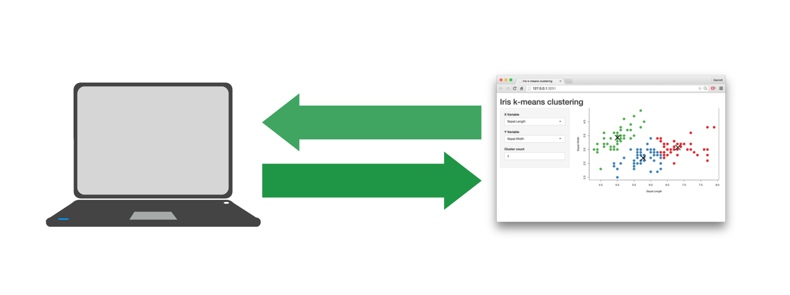
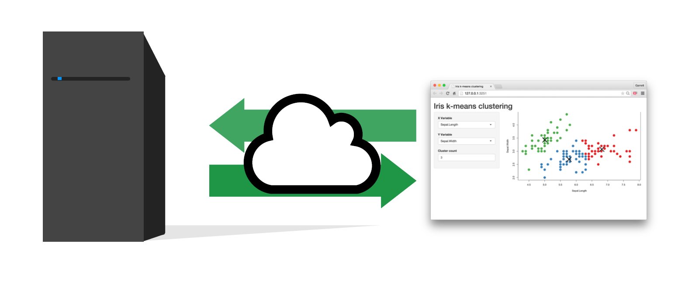
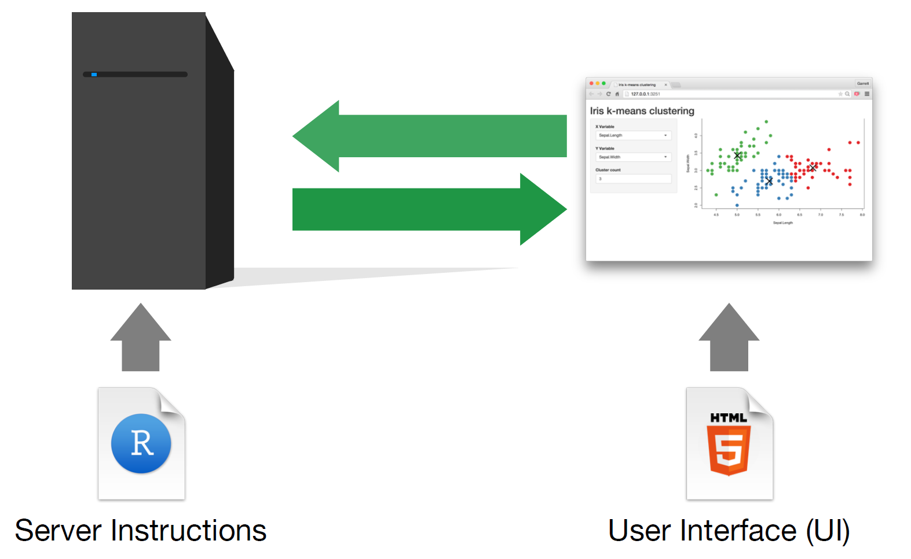
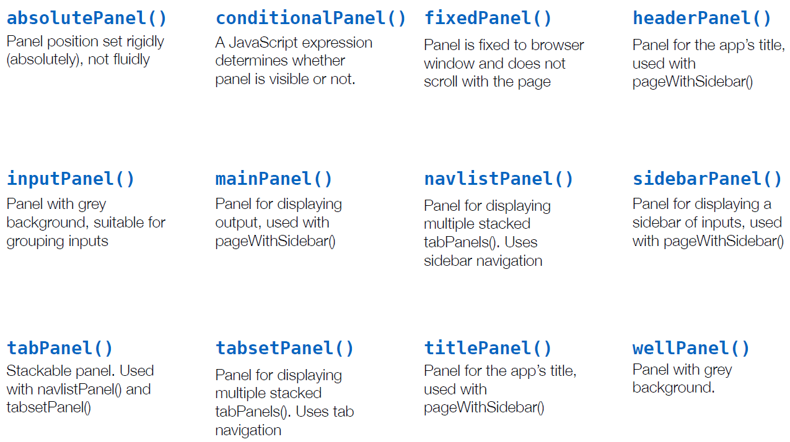
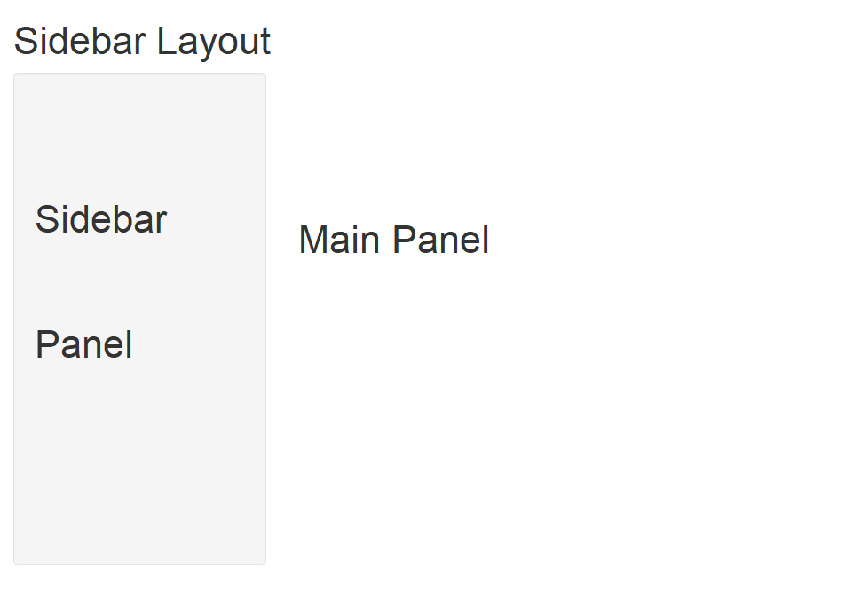
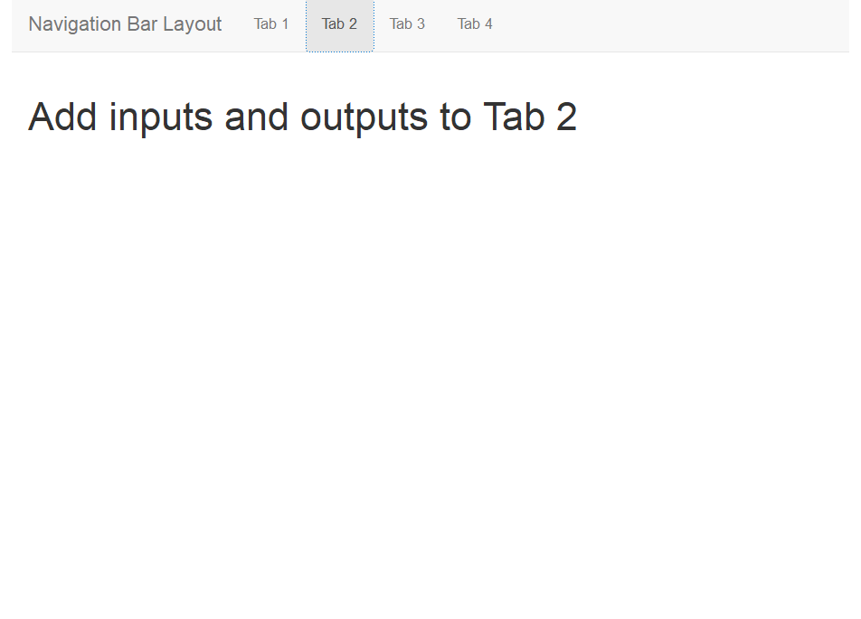
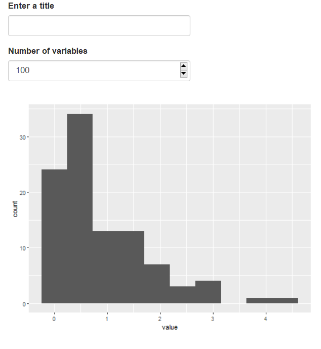

```{r include=FALSE}
knitr::opts_chunk$set(echo = TRUE, message = FALSE, warning = FALSE,
                      comment = "#>", highlight = TRUE,
                      fig.align = "center")
```

## Supplementary materials

Full video lecture available in Zoom Cloud Recordings

Additional resources

- Shiny [reactivity](https://shiny.rstudio.com/articles/#reactivity)
- Shiny [code quality](https://shiny.rstudio.com/articles/#code-quality)

---

class: inverse, center, middle

# Recall

---

## What is Shiny?

.pull-left[
- Shiny is an R package.
<br/><br/>
- Build web-based apps with R in RStudio.
<br/><br/>
- Shiny can incorporate CSS themes and JavaScript actions.

]

.pull-right[

]

---

## How does Shiny work?



---

## How does Shiny work?



---

## How does Shiny work?



---

## Main components of Rshiny

.pull-left[

```{r eval=FALSE}
 # Load package shiny
library(shiny)
# Define UI for application
ui <- fluidPage(
  
  
)

# Define server logic
server <- function(input, output) {
  
  
}

# Build and run the application
shinyApp(ui = ui, server = server)
```

]

.pull-right[
- Function `fluidPage()` creates a dynamic HTML user interface you see when you 
  look at an RShiny app. Convention is to save this as an object named `ui`.
  
- Function `server()` is user-defined and contains R commands your computer 
  or external server need to run the app.
  
- Function `shinyApp()` builds the app based on the user interface and 
  server pair of code.
]

---

## User interface review

- Build the user interface inside function `fluidPage()` and save it 
  as an object named `ui`.

- Function `fluidPage()` scales its components in real-time to fill all 
  available browser width - dynamic HTML user interface.

- Build inputs with `*Input(inputId, label, ...)`.

- Build outputs with `*Output(outputId, ...)`.

- Separate multiple inputs and outputs with commas.

- Run your app after each added input or output to minimize complications
  later on.

---

## Function `server()` review

- The server function does the work in terms of building and rebuilding R 
  objects.

- Save output you build to `output$<outputId>`.

- Build output with a `render*()` function.

- Access inputs with `input$<inputId>`.

- Multiple outputs can be placed in the server function.

- Reactivity happens automatically when you use inputs to build rendered
  outputs.

---

class: inverse, center, middle

# UI Layouts

---
  
## Layouts

- Use layout functions to position elements in your app.

<br/>

- Use panels to group elements into a single unit for aesthetic or
functional purposes.

<br/>

- Design your own layout or use a packaged layout.

---

## Rows with `fluidRow()`

```{r eval=FALSE}
ui <- fluidPage(
  
  fluidRow(
    
    # add inputs/outputs to row 1
    
  ),
  
  fluidRow(
    
    # add inputs/outputs to row 2
    
  ),
  
  fluidRow(
    
    # add inputs/outputs to row 3
    
  )
)
```


---

## Rows and columns

```{r eval=FALSE}
ui <- fluidPage(
  
  fluidRow(
    column(width = 5,
      # add inputs/outputs
      # column width 5
    ),
    column(width = 7,
      # add inputs/outputs
      # column width 7
    )
  ),
  
  fluidRow(
    column(width = 8, offset = 2,
      # add inputs/outputs
      # 2 units in from left
    )
  )
)
```

---

## Rows and columns example

.small[
```{r eval=FALSE}
ui <- fluidPage(
  
  fluidRow(
    column(width = 5,
      passwordInput(inputId = "pass",
                    label = "Enter password:"),
      actionButton(inputId = "passbtn",
                   label = "Submit password")
    ),

    column(width = 7,
      paste("Add some description in row 1",
            "of the column with a width of 7",
            "here...", sep = " ")
    )
  ),
  
  fluidRow(
    column(width = 8, offset = 2,
      checkboxGroupInput(inputId = "checks",
                         label = "",
                         choices = c("Choice 1", 
                                     "Choice 2",
                                     "Choice 3", 
                                     "Choice 4")),
      "Add some more text in Row 2 here..."
    )
  )
)
```
]

---

## Panels



---

## Packaged layout: `sidebarLayout()`

.pull-left[

.tiny[
```{r eval=FALSE}
ui <- fluidPage(
  
  # give a title in quotes
  titlePanel(), 
  
  sidebarLayout(
    
    sidebarPanel(
      
      # inputs/outputs
       
    ),
    
    mainPanel(

      # inputs/outputs
      
    )
  )
)
```
]

]

.pull-right[



]

---

## Packaged layout: `navbarPage()`

.pull-left[

.tiny[
```{r eval=FALSE}
ui <- fluidPage(
  
  navbarPage(title = "Navigation Bar Layout",
             
    tabPanel("Tab 1",
             # add inputs/outputs
             ),
    
    tabPanel("Tab 2",
             # add inputs/outputs
             ),
    
    tabPanel("Tab 3",
             # add inputs/outputs
            ),
    
    tabPanel("Tab 4",
             # add inputs/outputs
            )
             
  )
)
```
]

]

.pull-right[


]

---

## Packaged layout: `navbarPage()`

.pull-left[

.tiny[
```{r eval=FALSE}
ui <- fluidPage(
  
  navbarPage(title = "Navigation Bar Layout",
             
    tabPanel("Tab 1",
             # add inputs/outputs
             ),
    
    tabPanel("Tab 2",
             # add inputs/outputs
             ),
    
    tabPanel("Tab 3",
             # add inputs/outputs
            ),
    
    tabPanel("Tab 4",
             # add inputs/outputs
            )
             
  )
)
```
]

]

.pull-right[



]

---

## Layout recap

- Use `fluidRow()` to arrange elements in rows; use columns() to 
  arrange elements in columns, where total width is 12
  
- Use `sidebarPanel()` and `mainPanel()` to partition app with the packaged
  layout function sidebarLayout()
  
- Use `tabPanel()` with packaged layouts `navbarPage()` or `navbarMenu()`.

---

class: inverse, center, middle

# Reactivity

---

## Frequency of code execution

- Shiny will run the whole script the first time your app is launched.

- Each time a new user visits your app, Shiny runs the server function 
  again, one time.

- As users interact with widgets, Shiny will re-run the corresponding R
  expressions that depend on a widget whose value was changed.

---

## Consider the simple app

.pull-left[
.tiny[
```{r eval=FALSE}
library(shiny)
library(tidyverse)

# Build UI
ui <- fluidPage(
  textInput(inputId = "title", 
            label = "Enter a title"),
  
  numericInput(inputId = "num",
               label = "Number of variables",
               value = 100,
               min = 1),
  
  plotOutput(outputId = "hist")
)

# Define server function
server <- function(input, output) { 

  output$hist <- renderPlot({
    ggplot(as_tibble(rexp(input$num)), 
           aes(x = value)) +
      geom_histogram(bins = 10) +
      labs(title = input$title)
  })
}

# Run the application 
shinyApp(ui = ui, server = server)
```
]
]

.pull-right[

]

---

## Is there a problem?

.pull-left[
.tiny[
```{r eval=FALSE}
library(shiny)
library(tidyverse)

# Build UI
ui <- fluidPage(
  textInput(inputId = "title", 
            label = "Enter a title"),
  
  numericInput(inputId = "num",
               label = "Number of variables",
               value = 100,
               min = 1),
  
  plotOutput(outputId = "hist")
)

# Define server function
server <- function(input, output) { 

  output$hist <- renderPlot({
    ggplot(as_tibble(rexp(input$num)), 
           aes(x = value)) +
      geom_histogram(bins = 10) +
      labs(title = input$title)
  })
}

# Run the application 
shinyApp(ui = ui, server = server)
```
]
]

.pull-right[

- Every time you change the title, `labs(title = input$title)` new random
  numbers will be generated. If a single input changes in a block of code 
  inside a render function, then the entire block of code is re-run.
<br/><br/><br/><br/>
- This is very inefficient and can cause problems.

]

---

## Attempted solution

.pull-left[
.tiny[
```{r eval=FALSE}
library(shiny)
library(tidyverse)

# Build UI
ui <- fluidPage(
  textInput(inputId = "title", 
            label = "Enter a title"),
  
  numericInput(inputId = "num",
               label = "Number of variables",
               value = 100,
               min = 1),
  
  plotOutput(outputId = "hist")
)

# Define server function
server <- function(input, output) { 
  
  data <- rexp(input$num)

  output$hist <- renderPlot({
    ggplot(as_tibble(data), 
           aes(x = value)) +
      geom_histogram(bins = 10) +
      labs(title = input$title)
  })
}

# Run the application 
shinyApp(ui = ui, server = server)
```
]
]

.pull-right[

```r
Error in .getReactiveEnvironment()$currentContext(): 
Operation not allowed without
an active reactive context.

(You tried to do something that can
only be done from inside a reactive 
expression or observer.)
```
<br/><br/><br/><br/>
- Reactive inputs must be in a reactive-type function.

]

---

## Reactive expressions

The render functions are reactive-type functions. Function `reactive()` 
builds a reactive object. The object will respond to every 
reactive source in the code.

Rather than

```{r eval=FALSE}
data <- rexp(input$num)
```

use

```{r eval=FALSE}
data <- reactive({rexp(input$num)})
```

<br/>

--

A reactive expression has two special properties:

1. call a reactive expression like a function, `data()`;

2. reactive expressions cache their values, the value is retained until 
   it becomes invalidated.


---

## Solution

.tiny[
```{r eval=FALSE}
library(shiny)
library(tidyverse)

# Build UI
ui <- fluidPage(
  textInput(inputId = "title", 
            label = "Enter a title"),
  
  numericInput(inputId = "num",
               label = "Number of variables",
               value = 100,
               min = 1),
  
  plotOutput(outputId = "hist")
)

# Define server function
server <- function(input, output) { 
  
  data <- reative({rexp(input$num)})

  output$hist <- renderPlot({
    ggplot(as_tibble(data()), 
           aes(x = value)) +
      geom_histogram(bins = 10) +
      labs(title = input$title)
  })
}

# Run the application 
shinyApp(ui = ui, server = server)
```
]

---

## Complementary functions for reactivity

<br/><br/>

|          Function | Purpose                                |
|------------------:|:---------------------------------------|
|       `isolate()` | prevent reactions                      |
|  `observeEvent()` | trigger code, useful for action button |
|       `observe()` | similar to `observeEvent()`            |
| `eventReactive()` | delay reactions                        |

---


class: inverse, center, middle

# Dynamic UI

---

## Dynamic interface

Shiny offers four main approaches to build a dynamic UI:

1. Function `conditionalPanel()`: wraps UI elements, does require very 
   very minimal JavaScript knowledge
<br/><br/><br/><br/>
2. Function `renderUI()`: use in `server()` in conjunction with the 
   `uiOutput()` function in `ui`, lets you generate calls to UI functions 
   and make the results appear in a predetermined place in the UI.
<br/><br/><br/><br/>
3. Functions `insertUI()` and `removeUI()`: allow you to add or remove pieces
   of UI code
<br/><br/><br/><br/>
4. Use JavaScript directly

---

## References

1. Shiny. (2020). https://shiny.rstudio.com/.


