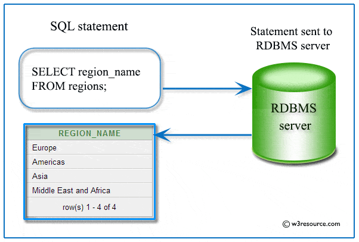
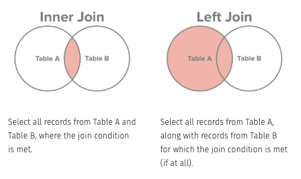
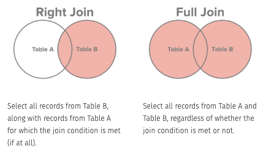

```{r include=FALSE}
knitr::opts_chunk$set(echo = TRUE, message = FALSE, warning = FALSE,
                      comment = "#>", highlight = TRUE,
                      fig.align = "center")
```

## Supplementary materials

Full video lecture available in Zoom Cloud Recordings

Additional resources

- [SQL Tutorial](https://www.w3resource.com/sql/tutorials.php)
- Package `nodbi` [vignette](https://docs.ropensci.org/nodbi/)

---

class: inverse, center, middle

# Recall

---

## Databases

A **database** is a collection of data typically stored in a computer system. 
It is controlled by a **database management system (DBMS)**. There may be 
applications associated with them, such as an API.

<br/>

--

Types of DBMS: MySQL, Microsoft Access, Microsoft SQL Server, FileMaker Pro, 
Oracle Database, and dBASE.

<br/>

Types of databases: Relational, object-oriented, distributed, NoSQL, graph,
and more.

---

## Big picture

<center>

</center>

<br/>

*Source*: https://www.w3resource.com/sql/tutorials.php

---

## Common SQL query structure

Main verbs to get data:

```sql
SELECT columns or computations
  FROM table
  WHERE condition
  GROUP BY columns
  HAVING condition
  ORDER BY column [ASC | DESC]
  LIMIT offset, count
```
`WHERE`, `GROUP BY`, `HAVING`, `ORDER BY`, `LIMIT` are all optional. Primary
computations: `MIN`, `MAX`, `COUNT`, `SUM`, `AVG`.

<br/>

We can perform these queries in R with `dbGetQuery()` and `paste()`. This can
be done after setting up an in-memory database or connecting to a remote
database.

---

## SQL arithmetic and comparison operators

SQL supports the standard `+`, `-`, `*`, `/`, and `%` (modulo) arithmetic
operators and the following comparison operators.

<br/>

| Operator |        Description       |
|:--------:|:-------------------------|
|     `=`  |         Equal to         |
|     `>`  |       Greater than       |
|     `<`  |         Less than        |
|    `>=`  | Greater than or equal to |
|    `<=`  |   Less than or equal to  |
|    `<>`  |       Not equal to       |

---

## SQL logical operators

| Operator  |                          Description                         |
|----------:|:-------------------------------------------------------------|
|     `ALL` | TRUE if all of the subquery values meet the condition        |
|     `AND` | TRUE if all the conditions separated by AND is TRUE          |
|     `ANY` | TRUE if any of the subquery values meet the condition        |
| `BETWEEN` | TRUE if the operand is within the range of comparisons       |
|  `EXISTS` | TRUE if the subquery returns one or more records             |
|      `IN` | TRUE if the operand is equal to one of a list of expressions |
|    `LIKE` | TRUE if the operand matches a pattern                        |
|     `NOT` | Displays a record if the condition(s) is NOT TRUE            |
|      `OR` | TRUE if any of the conditions separated by OR is TRUE        |
|    `SOME` | TRUE if any of the subquery values meet the condition        |

---

class: center, middle, inverse

# SQLite and `sqlite3`

---

## `SQLite` and `sqlite3`

SQLite is a software library that provides a relational database 
management system. The lite in SQLite means light weight in terms of setup, 
database administration, and required resource.

This is available on the DSS servers. In your terminal

```sql
[sms185@numeric1 ~]$ which sqlite3 
/usr/bin/sqlite3
```

Check out

```sql
man sqlite3
```

From the summary:

>sqlite3 is a terminal-based front-end to the SQLite library that can 
evaluate queries interactively and display the results in multiple formats.  
sqlite3 can also be used within shell scripts and other applications to provide 
batch processing features.

---

## Today's data

From your home directory, copy `sql_databases/` from my home directory on the 
DSS home file system.

```bash
cp -rf /home/fac/sms185/sql_databases ~/
```

You should see the following in `sql_databases/`:

```bash
[sms185@geometry2 sql_databases]$ ls
taxi.sqlite  vet.sqlite
```

---

## Load sqlite3

Load sqlite3 with the database `vet.sqlite`.

```bash
*[sms185@geometry2 sql_databases]$ sqlite3 vet.sqlite
SQLite version 3.26.0 2018-12-01 12:34:55
Enter ".help" for usage hints.
sqlite>
```

---

## Commands in `sqlite3`

1. **Query commands**: `sqlite3` just reads lines of input and passes them on to 
   the SQLite library for execution. This will be the typical command you
   provide when you want to access, update, and merge data tables.

2. **Dot commands**: these are lines that begin with a dot (".") and are 
   interpreted by the `sqlite3` program itself. These 
   commands are typically used to change the output format of queries, or to 
   execute certain prepackaged query statements. 

<br/>

Both sets of the commands are entered at the prompt: `sqlite>`.
   
---

## Help

Typing `.help` at the prompt will reveal some of the help features and 
functions.

```sql
sqlite> .help
.archive ...         Manage SQL archives
.auth ON|OFF         Show authorizer callbacks
.backup ?DB? FILE    Backup DB (default "main") to FILE
.bail on|off         Stop after hitting an error.  Default OFF
.binary on|off       Turn binary output on or off.  Default OFF
.cd DIRECTORY        Change the working directory to DIRECTORY
.changes on|off      Show number of rows changed by SQL
.check GLOB          Fail if output since .testcase does not match
.clone NEWDB         Clone data into NEWDB from the existing database

 ....                ....

.trace FILE|off      Output each SQL statement as it is run
.vfsinfo ?AUX?       Information about the top-level VFS
.vfslist             List all available VFSes
.vfsname ?AUX?       Print the name of the VFS stack
.width NUM1 NUM2 ... Set column widths for "column" mode
```

---

## Navigating `sqlite3`

View the current settings

```sql
sqlite> .show
        echo: off
         eqp: off
     explain: auto
     headers: off
        mode: list
   nullvalue: ""
      output: stdout
colseparator: "|"
rowseparator: "\n"
       stats: off
       width:
    filename: vet.sqlite
```

---

List all names and files of attached databases

```sql
sqlite> .databases
main: /home/fac/sms185/sql_databases/vet.sqlite
```

<br/>

--

List all the tables in the current database


```sql
sqlite> .tables
owners      pets     procedure_details    procedure_history
```

---

## Table details

Show the `CREATE` statements matching the specified table

.tiny.pull-left[
```sql
sqlite> .schema owners
CREATE TABLE `owners` (
  `owner_id` REAL,
  `name` TEXT,
  `surname` TEXT,
  `street_address` TEXT,
  `city` TEXT,
  `state` TEXT,
  `state_full` TEXT,
  `zip_code` REAL
);
```

```sql
sqlite> .schema procedure_details
CREATE TABLE `procedure_details` (
  `procedure_type` TEXT,
  `procedure_sub_code` TEXT,
  `description` TEXT,
  `price` REAL
);
```
]

.tiny.pull-right[
```sql
sqlite> .schema pets
CREATE TABLE `pets` (
  `pet_id` TEXT,
  `name` TEXT,
  `kind` TEXT,
  `gender` TEXT,
  `age` REAL,
  `owner_id` REAL
);
```

```sql
sqlite> .schema procedure_history
CREATE TABLE `procedure_history` (
  `pet_id` TEXT,
  `date` REAL,
  `procedure_type` TEXT,
  `procedure_sub_code` TEXT
);
```
]

<br/>

*Note the `;` at the end.*

---

class: center, middle, inverse

# Queries

---

## Query commands

Get the first 5 rows from table `owners`. Every query must end with a
semicolon.

.tiny[
```sql
sqlite> SELECT * FROM owners
        LIMIT 5;
6049.0|Debbie|Metivier|315 Goff Avenue|Grand Rapids|MI|Michigan|49503.0
2863.0|John|Sebastian|3221 Perry Street|Davison|MI|Michigan|48423.0
3518.0|Connie|Pauley|1539 Cunningham Court|Bloomfield Township|MI|Michigan|48302.0
3663.0|Lena|Haliburton|4217 Twin Oaks Drive|Traverse City|MI|Michigan|49684.0
1070.0|Jessica|Velazquez|3861 Woodbridge Lane|Southfield|MI|Michigan|48034.0
```
]

--

How about a nicer output? Change the mode and headers settings.

.tiny[
```sql
sqlite> .mode column 
sqlite> .headers on  
sqlite> SELECT * FROM owners
        LIMIT 5;
owner_id    name      surname     street_address   city          state  state_full  zip_code
----------  -------   ----------  ---------------  ------------  ------ ----------  ----------
6049.0      Debbie    Metivier    315 Goff Avenue  Grand Rapids  MI     Michigan    49503.0
2863.0      John      Sebastian   3221 Perry Stre  Davison       MI     Michigan    48423.0
3518.0      Connie    Pauley      1539 Cunningham  Bloomfield T  MI     Michigan    48302.0
3663.0      Lena      Haliburton  4217 Twin Oaks   Traverse Cit  MI     Michigan    49684.0
1070.0      Jessica   Velazquez   3861 Woodbridge  Southfield    MI     Michigan    48034.0
```
]

---

## Revist `.show`

```sql
sqlite> .show
        echo: off
         eqp: off
     explain: auto
*    headers: on
*       mode: column
   nullvalue: ""
      output: stdout
colseparator: "|"
rowseparator: "\n"
       stats: off
       width:
    filename: vet.sqlite
```

---

## Examples

How many owners exist for each zip code? Sort the results in descending order
and only show the zip codes with at least 3 owners.

```sql
sqlite> SELECT zip_code, COUNT(zip_code) AS count
        FROM owners
        GROUP BY zip_code
        HAVING count >= 3
        ORDER BY count DESC;
zip_code    count
----------  ----------
48075.0     11
49503.0     10
48933.0     5
48034.0     4
48219.0     4
48302.0     4
49855.0     4
48342.0     3
48607.0     3
```

---

How many of each kind of pet exist? Only output a table with the type of
pet and the respective count.

```sql
sqlite> SELECT kind, COUNT(kind) as n FROM pets
        GROUP BY kind;
kind        n
----------  ----------
Cat         31
Dog         57
Parrot      12
```

---

## Exercise

Which procedure types had an average price exceed $20? Sort them in descending
order by average price. Only output a table with the procedure types and their 
average price.

<br/>

```sql
procedure_type     avg_price
-----------------  ----------------
GENERAL SURGERIES  312.526315789474
ORTHOPEDIC         196.333333333333
OFFICE FEES        52.0
HOSPITALIZATION    25.0
```

???

## Solution

.solution[
```sql
sqlite> SELECT procedure_type, AVG(price) as avg_price FROM procedure_details
        GROUP BY procedure_type
        HAVING AVG(price) > 20
        ORDER BY AVG(price) DESC;
procedure_type     avg_price
-----------------  ----------------
GENERAL SURGERIES  312.526315789474
ORTHOPEDIC         196.333333333333
OFFICE FEES        52.0
HOSPITALIZATION    25.0
```
]

---

## Creating new tables from existing tables

**Create** with command `CREATE TABLE`

```sql
sqlite> CREATE TABLE owners_lansing(
        owner_id REAL,
        name TEXT,
        surname TEXT);
```

We are specifying the table name, `owners_lansing`, variables names, and their
type.

--

**Add data** with command `INSERT INTO`

```sql
sqlite> INSERT INTO owners_lansing
        SELECT owner_id, name, surname
        FROM owners
        WHERE city = "Lansing";
```

---

**Verify** our result is correct

```sql
sqlite> .tables
owners             pets               procedure_history
owners_lansing     procedure_details
```

--

```sql
sqlite> SELECT * FROM owners_lansing;
owner_id    name        surname
----------  ----------  ----------
7663.0      Julia       Gowan
1653.0      Carolyn     Crane
4793.0      Thomas      Arnold
4110.0      Gregory     Aucoin
3691.0      Richard     Duke
5447.0      Arthur      Reed
```

```sql
sqlite> SELECT owner_id, name, surname, city
        FROM owners
        WHERE city = "Lansing";
owner_id    name        surname    city     
----------  ----------  ---------- ----------
7663.0      Julia       Gowan      Lansing     
1653.0      Carolyn     Crane      Lansing     
4793.0      Thomas      Arnold     Lansing     
4110.0      Gregory     Aucoin     Lansing     
3691.0      Richard     Duke       Lansing     
5447.0      Arthur      Reed       Lansing     
```

---

class: center, middle, inverse

# Joins

---

## Join tables

.small.pull-left[
```sql
sqlite> SELECT owner_id, name, surname
        FROM owners
        ORDER BY owner_id
        LIMIT 10;
owner_id    name        surname
----------  ----------  ----------
*1070.0      Jessica     Velazquez
1132.0      Rosa        Quarles
1202.0      Susan       Jackson
*1306.0      Benjamin    Spears
1312.0      Charles     Chidester
1319.0      Joe         Custer
1334.0      Jason       Cantwell
1546.0      Joseph      Blow
1653.0      Carolyn     Crane
1766.0      Doris       Ray
```
]

.small.pull-right[
```sql
sqlite> SELECT name, kind, owner_id
        FROM pets
        ORDER BY owner_id
        LIMIT 10;
name        kind        owner_id
----------  ----------  ----------
*Biscuit     Dog         1070.0
Stowe       Cat         1132.0
Enyo        Cat         1202.0
*Danger      Dog         1306.0
*Collette    Dog         1306.0
Rumba       Cat         1312.0
Heisenberg  Dog         1319.0
Crockett    Dog         1334.0
Blackie     Dog         1546.0
Cookie      Cat         1653.0
```
]

We can see that Biscuit belongs to Jessica and Benjamin owns two pets - Danger
and Collette.

<br/>

--

How can we merge these two tables?

---

## Some joins visualized

.center[




]

*Source:* http://www.sql-join.com/sql-join-types

---

## Default join

.tiny[
```sql
sqlite> SELECT *
   ...> FROM owners
   ...> JOIN pets
   ...> LIMIT 10;
owner_id    name        surname     street_address   city          state       state_full  zip_code    pet_id      name        kind        gender      age         owner_id
----------  ----------  ----------  ---------------  ------------  ----------  ----------  ----------  ----------  ----------  ----------  ----------  ----------  ----------
6049.0      Debbie      Metivier    315 Goff Avenue  Grand Rapids  MI          Michigan    49503.0     J6-8562     Blackie     Dog         male        11.0        5168.0
6049.0      Debbie      Metivier    315 Goff Avenue  Grand Rapids  MI          Michigan    49503.0     Q0-2001     Roomba      Cat         male        9.0         5508.0
6049.0      Debbie      Metivier    315 Goff Avenue  Grand Rapids  MI          Michigan    49503.0     M0-2904     Simba       Cat         male        1.0         3086.0
6049.0      Debbie      Metivier    315 Goff Avenue  Grand Rapids  MI          Michigan    49503.0     R3-7551     Keller      Parrot      female      2.0         7908.0
6049.0      Debbie      Metivier    315 Goff Avenue  Grand Rapids  MI          Michigan    49503.0     P2-7342     Cuddles     Dog         male        13.0        4378.0
6049.0      Debbie      Metivier    315 Goff Avenue  Grand Rapids  MI          Michigan    49503.0     X0-8765     Vuitton     Parrot      female      11.0        7581.0
6049.0      Debbie      Metivier    315 Goff Avenue  Grand Rapids  MI          Michigan    49503.0     Z4-5652     Priya       Cat         female      7.0         7343.0
6049.0      Debbie      Metivier    315 Goff Avenue  Grand Rapids  MI          Michigan    49503.0     Z4-4045     Simba       Cat         male        0.0         2700.0
6049.0      Debbie      Metivier    315 Goff Avenue  Grand Rapids  MI          Michigan    49503.0     M8-7852     Cookie      Cat         female      8.0         7606.0
6049.0      Debbie      Metivier    315 Goff Avenue  Grand Rapids  MI          Michigan    49503.0     J2-3320     Heisenberg  Dog         male        3.0         1319.0
```
]

--

What happened with this join? Do you see anything wrong with our result?

--

By default, a cross join was used, and it combines every row from the first 
table with every row from the second table to form the 
resulting table.

---

## Natural join

.tiny[
```sql
sqlite> SELECT * FROM owners
        NATURAL JOIN pets;
owner_id    name        surname     street_address     city          state       state_full  zip_code    pet_id      kind        gender      age
----------  ----------  ----------  -----------------  ------------  ----------  ----------  ----------  ----------  ----------  ----------  ----------
2809.0      Bruce       Dunne       4119 Kimberly Way  Grand Rapids  MI          Michigan    49503.0     K0-8177     Dog         male        12.0
```
]

<br/>

--

What happened with this join?

--

In the `NATURAL JOIN`, all the columns from both tables with the same names
will be matched against each other. It automatically tests for equality between 
the values of every column that exists in both tables.

.tiny.pull-left[
```sql
sqlite> .schema owners
CREATE TABLE `owners` (
  `owner_id` REAL,
  `name` TEXT,
  `surname` TEXT,
  `street_address` TEXT,
  `city` TEXT,
  `state` TEXT,
  `state_full` TEXT,
  `zip_code` REAL
);
```
]

.tiny.pull-right[
```sql
sqlite> .schema pets
CREATE TABLE `pets` (
  `pet_id` TEXT,
  `name` TEXT,
  `kind` TEXT,
  `gender` TEXT,
  `age` REAL,
  `owner_id` REAL
);
```
]

---

## Be explicit on your (inner) join

Inner join conditions can be set with the `USING` verb.

.tiny[
```sql
sqlite> SELECT owner_id, name, surname, name, kind
        FROM owners
        JOIN pets
        USING (owner_id)
        ORDER BY owner_id
        LIMIT 10;
*Error: ambiguous column name: name
```
]

--

.tiny[
```sql
sqlite> SELECT owner_id, owners.name, surname, pets.name, kind
        FROM owners
        JOIN pets
        USING (owner_id)
        ORDER BY owner_id
        LIMIT 10;
owner_id    name        surname     name        kind
----------  ----------  ----------  ----------  ----------
*1070.0      Jessica     Velazquez   Biscuit     Dog
1132.0      Rosa        Quarles     Stowe       Cat
1202.0      Susan       Jackson     Enyo        Cat
*1306.0      Benjamin    Spears      Collette    Dog
*1306.0      Benjamin    Spears      Danger      Dog
1312.0      Charles     Chidester   Rumba       Cat
1319.0      Joe         Custer      Heisenberg  Dog
1334.0      Jason       Cantwell    Crockett    Dog
1546.0      Joseph      Blow        Blackie     Dog
1653.0      Carolyn     Crane       Cookie      Cat    
```
]

---

## Left join

Perform a left join with `owners` and `pets`.


```sql
sqlite> SELECT *
   ...> FROM owners
   ...> LEFT JOIN pets
   ...> ON owners.owner_id = pets.owner_id
   ...> ORDER BY owner_id
   ...> LIMIT 10;
owner_id    name        surname     street_address        city        state       state_full  zip_code    pet_id      name        kind        gender      age         owner_id
----------  ----------  ----------  --------------------  ----------  ----------  ----------  ----------  ----------  ----------  ----------  ----------  ----------  ----------
1070.0      Jessica     Velazquez   3861 Woodbridge Lane  Southfield  MI          Michigan    48034.0     U8-6473     Biscuit     Dog         female      3.0         1070.0
1132.0      Rosa        Quarles     4791 Tennessee Avenu  Southfield  MI          Michigan    48034.0     T2-2142     Stowe       Cat         female      15.0        1132.0
1202.0      Susan       Jackson     3677 Daylene Drive    Livonia     MI          Michigan    48154.0     N7-6805     Enyo        Cat         female      12.0        1202.0
1306.0      Benjamin    Spears      1507 Twin Oaks Drive  Clam River  MI          Michigan    49612.0     F2-3235     Danger      Dog         male        8.0         1306.0
1306.0      Benjamin    Spears      1507 Twin Oaks Drive  Clam River  MI          Michigan    49612.0     L2-1834     Collette    Dog         female      4.0         1306.0
1312.0      Charles     Chidester   4086 Cottonwood Lane  Dutton      MI          Michigan    49316.0     L4-4205     Rumba       Cat         male        5.0         1312.0
1319.0      Joe         Custer      2765 Wildrose Lane    Westland    MI          Michigan    48185.0     J2-3320     Heisenberg  Dog         male        3.0         1319.0
1334.0      Jason       Cantwell    2372 Don Jackson Lan  Southfield  MI          Michigan    48075.0     J0-7893     Crockett    Dog         male        12.0        1334.0
1546.0      Joseph      Blow        556 D Street          Southfield  MI          Michigan    48075.0     U6-4890     Blackie     Dog         male        6.0         1546.0
1653.0      Carolyn     Crane       3952 Jarvisville Roa  Lansing     MI          Michigan    48933.0     P9-6519     Cookie      Cat         female      6.0         1653.0
```


---

```sql
sqlite> SELECT *
   ...> FROM pets
   ...> LEFT JOIN owners
   ...> USING (owner_id)
   ...> ORDER BY owner_id
   ...> LIMIT 10;
pet_id      name        kind        gender      age         owner_id    name        surname     street_address        city        state       state_full  zip_code
----------  ----------  ----------  ----------  ----------  ----------  ----------  ----------  --------------------  ----------  ----------  ----------  ----------
U8-6473     Biscuit     Dog         female      3.0         1070.0      Jessica     Velazquez   3861 Woodbridge Lane  Southfield  MI          Michigan    48034.0
T2-2142     Stowe       Cat         female      15.0        1132.0      Rosa        Quarles     4791 Tennessee Avenu  Southfield  MI          Michigan    48034.0
N7-6805     Enyo        Cat         female      12.0        1202.0      Susan       Jackson     3677 Daylene Drive    Livonia     MI          Michigan    48154.0
F2-3235     Danger      Dog         male        8.0         1306.0      Benjamin    Spears      1507 Twin Oaks Drive  Clam River  MI          Michigan    49612.0
L2-1834     Collette    Dog         female      4.0         1306.0      Benjamin    Spears      1507 Twin Oaks Drive  Clam River  MI          Michigan    49612.0
L4-4205     Rumba       Cat         male        5.0         1312.0      Charles     Chidester   4086 Cottonwood Lane  Dutton      MI          Michigan    49316.0
J2-3320     Heisenberg  Dog         male        3.0         1319.0      Joe         Custer      2765 Wildrose Lane    Westland    MI          Michigan    48185.0
J0-7893     Crockett    Dog         male        12.0        1334.0      Jason       Cantwell    2372 Don Jackson Lan  Southfield  MI          Michigan    48075.0
U6-4890     Blackie     Dog         male        6.0         1546.0      Joseph      Blow        556 D Street          Southfield  MI          Michigan    48075.0
P9-6519     Cookie      Cat         female      6.0         1653.0      Carolyn     Crane       3952 Jarvisville Roa  Lansing     MI          Michigan    48933.0
```

<br/>

--

SQLite does not support a `RIGHT JOIN`.

---

## Exercises

Which owners have multiple pets? Sort your table so the count is in 
descending order. Only output a table with the owners' name,
surname and number of pets.
   
```sql
owner_name  owner_surname  pet_count
----------  -------------  ----------
Lee         McKenzie       3
Charles     Swarey         3
Stacey      Randolph       3
Benjamin    Spears         2
Robert      Partridge      2
Mario       Riddle         2
Elvia       Warren         2
Gary        Snider         2
```

Which pet under the age of 10 had the most procedures according to the
procedure history? Only return a table with the pet's name, kind, age, and 
number of procedures.
   
```sql
name        kind        age         procedure_count
----------  ----------  ----------  ---------------
Bonaparte   Dog         4.0         3
```

???

## Solution

```sql
sqlite> SELECT owners.name AS owner_name, surname AS owner_surname,
        COUNT(owners.owner_id) AS pet_count
        FROM owners
        LEFT JOIN pets ON owners.owner_id = pets.owner_id
        GROUP BY owners.owner_id
        HAVING COUNT(owners.owner_id) > 1
        ORDER BY COUNT(owners.owner_id) DESC;
```

```sql
sqlite> SELECT pets.name, kind, age, COUNT(procedure_history.pet_id) as procedure_count
        FROM pets
        LEFT JOIN procedure_history ON pets.pet_id = procedure_history.pet_id
        WHERE age < 10
        GROUP BY procedure_history.pet_id
        ORDER BY COUNT(procedure_history.pet_id) DESC
        LIMIT 1;
```

---

class: middle, center, inverse

# Finer details

---

## SQL statement processing

What happens in the background when a SQL statement is sent to the RDBMS?

1. The SQL statement is parsed around key words.

2. The statement is validated. Do all tables and fields exist? Are names
   unambiguous?
   
3. The RDBMS optimizes and eventually generates an access plan - how best
   to retrieve the data, update the data, or delete the data.
   
4. The access plan is executed.

---

## Subqueries

A subquery may occur in a
- SELECT clause
- FROM clause
- WHERE clause

The inner (sub) query executes first before its parent query so that the 
results of an inner query can be passed to the outer query.


```sql
sqlite> SELECT *
        FROM pets
        WHERE pet_id IN (
          SELECT pet_id FROM procedure_history
          WHERE procedure_type = "ORTHOPEDIC"
        );
```

<br/>

What are we trying to get with the above query?

---

## Tips

- On very large datasets use indices to speed up searches.

- Use `CAST` to change data types in a query.

- Attach databases to perform `JOIN` operations on tables across databases.

- See your query and improve performance with `EXPLAIN QUERY PLAN` followed
  by your query.
  
---

## Beyond SQL: NoSQL

- Document 
- Graph stores
- Key-value stores
- Wide-column stores

R package `nodbi` provides a single user interface for interacting with many 
NoSQL databases. This is similar to package `DBI` for interacting with
relational databases that use SQL.

R package `nodbi` supports:

- MongoDB
- Redis (server based)
- CouchDB
- Elasticsearch
- SQLite

Check out their vignette for more information: https://docs.ropensci.org/nodbi/

---

## References

1. SQL Join Types — SQL Joins Explained. (2020). 
   http://www.sql-join.com/sql-join-types.

2. SQL Tutorial - w3resource. (2020). https://www.w3resource.com/sql/tutorials.php.

3. What is NoSQL? NoSQL Databases Explained. (2020).
   https://www.mongodb.com/nosql-explained.
