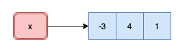
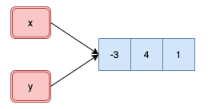
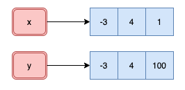
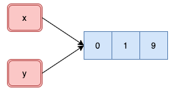

```{r include=FALSE}
knitr::opts_chunk$set(echo = TRUE, message = FALSE, warning = FALSE,
                      comment = "#>", highlight = TRUE,
                      fig.align = "center")
```

## Supplementary materials

Full video lecture available in Zoom Cloud Recordings

Additional resources

- [Chapter 2](https://adv-r.hadley.nz/names-values.html), Advanced R by Wickham, H.
- `vroom` [vignette](https://cran.r-project.org/web/packages/vroom/vignettes/vroom.html)

---

class: inverse, center, middle

# Memory basics

---

## Names and values

In R, a name has a value. It is not the value that has a name.

For example, in

```{r}
x <- c(-3, 4, 1)
```

the object named `x` is a reference to vector `c(-3, 4, 1)`.

<br/>

<center>

</center>

---

We can see where this lives in memory with

```{r}
library(lobstr)
lobstr::obj_addr(x)
```

and its size with

```{r}
lobstr::obj_size(x)
```

---

## Copy-on-modify: atomic vectors

Understanding when R creates a copy of an object will allow you to write
faster code. This is also important to keep in mind when working with very
large vectors.

```{r}
x <- c(-3, 4, 1)
y <- x
```

--

```{r}
obj_addr(x)
obj_addr(y)
```

<center>

</center>

---

```{r}
y[3] <- 100
```

--

```{r}
obj_addr(x)
obj_addr(y)
```

<center>

</center>

---

.pull-left[
```{r}
x <- c(0, 1, 9)
y <- x

obj_addr(x)
obj_addr(y)
```

```{r}
y[4] <- -100
obj_addr(x)
obj_addr(y)
```
]
.pull-right[
<br/>
<center>

</center>

<br/><br/>
<center>

</center>
]

<br/>

--

Even though only one component changed in the atomic vector `y`, R created
a new object as seen by the new address in memory.

???

## Copy-on-modify and loops

Poor loop implementation

.tiny[
```{r eval=FALSE}
n <- 8
x <- 1
for (i in seq_len(n)) {
  cat("Object address start iteration", i, ":", obj_addr(x), "\n")
  x <- c(x, sqrt(x[i] * i))
  cat("Object address end iteration  ", i, ":", obj_addr(x), "\n\n")
}
```
]

"Efficient" loop implementation

.tiny[
```{r eval=FALSE}
n <- 8
x <- rep(1, n + 1)
ref(x)
for (i in seq_len(n)) {
  cat("Object address start iteration", i, ":", ref(x), "\n")
  x[i + 1] <- mean(x[i] * i)
  cat("Object address end iteration  ", i, ":", ref(x), "\n\n")
}
```
]

---

## Memory tracking

Function `tracemem()` marks an object so that a message is printed whenever the 
internal code copies the object. Let's see when `x` gets copied.

<br/><br/>

```{r}
x <- c(0, 1, 1, 2, 3, 5, 8, 13, 21, 34)
tracemem(x)
```

--

```{r}
y <- x
```

--

```{r}
y[1] <- 0
```

---

```{r}
x
y
c(obj_addr(x), obj_addr(y))
```

--

```{r}
x[1] <- 0
```

--

```{r}
lobstr::ref(x)
lobstr::ref(y)
untracemem(x)
```

---

## Copy-on-modify: lists

```{r}
x <- list(a = 1, b = 2, c = 3)
obj_addr(x)
```

--

```{r}
y <- x
```

--

```{r}
c(obj_addr(x), obj_addr(y))
```

--

```{r}
ref(x, y)
```

---

```{r}
y$c <- 4
```

--

```{r}
ref(x, y)
```

---

```{r}
x <- list(a = 1, b = 2, c = 3)
y <- x
```

--

```{r}
c(obj_addr(x), obj_addr(y))
```

--

```{r}
y$d <- 9
ref(x, y)
```

<br/>

R creates a shallow copy. Shared components exist with elements `a`, `b`, and
`c`.

---

## Copy-on-modify: data frames

```{r}
library(tidyverse)
x <- tibble(a = 1:3, b = 9:7)
```

--

```{r}
ref(x)
```

--

```{r}
y <- x %>% 
  mutate(b = b ^ 2)
```

--

```{r}
ref(x, y)
```

---

```{r}
z <- x
ref(x, z)
```

--

```{r}
z <- x %>% 
  add_row(a = -1, b = -1)
```

--

```{r}
ref(x, z)
```

--

<br/>

If you modify a column, only that column needs to be copied in memory. However,
if you modify a row, the entire data frame is copied in memory.

---

## Exercise

Can you diagnose what is going on below?

```{r}
x <- 1:10; y <- x;

tracemem(x)
c(obj_addr(x), obj_addr(y))

y[1] <- 3
```

---

## Object size

Object sizes can sometimes be deceiving.

```{r}
x <- rnorm(1e6)
y <- 1:1e6
z <- seq(1, 1e6, by = 1)
s <- (1:1e6) / 2
```

--

```{r}
c(obj_size(x), obj_size(y), obj_size(z), obj_size(s))
```

---

```{r}
c(obj_size(c(1L)), obj_size(c(1.0)))
```

--

```{r}
c(obj_size(c(1L, 2L)), obj_size(as.numeric(c(1.0, 2.0))))
```

--

```{r}
c(obj_size(c(1L, 2L, 3L)), obj_size(as.numeric(c(1.0, 2.0, 3.0))))
```

--

```{r}
c(obj_size(integer(10000)), obj_size(numeric(10000)))
```

<br/>

--

There is overhead with creating vectors in R. Take a look at `?Memory` if
you want to dig deeper as to the overhead cost.

---

## Exercise

Starting from 0 we can see that

```{r}
lobstr::obj_size(integer(0))
lobstr::obj_size(numeric(0))
```

are both 48 bytes. Based on the results on the next slide can you deduce how 
R handles these numeric data in memory?

---

```{r}
diff(sapply(0:100, function(x) lobstr::obj_size(integer(x))))
```

```{r}
c(obj_size(integer(20)), obj_size(integer(22)))
```


```{r}
diff(sapply(0:100, function(x) lobstr::obj_size(numeric(x))))
```

```{r}
c(obj_size(numeric(10)), obj_size(numeric(14)))
```

---

class: inverse, center, middle

# I/O big data

---

## Getting big data into R

Dimensions: 3,185,906 x 9

```{r}
url <- "http://www2.stat.duke.edu/~sms185/data/bike/cbs_2015.csv"
```

.tiny[
```{r eval=FALSE}
system.time({x <- read.csv(url)})
```

```{r eval=FALSE}
   user  system elapsed 
*29.739   1.085  37.321 
```
]

--

.tiny[
```{r eval=FALSE}
system.time({x <- readr::read_csv(url)})
```

```{r eval=FALSE}
Parsed with column specification:
cols(
  Duration = col_double(),
  `Start date` = col_datetime(format = ""),
  `End date` = col_datetime(format = ""),
  `Start station number` = col_double(),
  `Start station` = col_character(),
  `End station number` = col_double(),
  `End station` = col_character(),
  `Bike number` = col_character(),
  `Member type` = col_character()
)
|================================| 100%  369 MB
   user  system elapsed 
*12.773   1.727  22.327 
```
]

---

.tiny[
```{r eval=FALSE}
system.time({x <- data.table::fread(url)})
```

```{r eval=FALSE}
trying URL 'http://www2.stat.duke.edu/~sms185/data/bike/cbs_2015.csv'
Content type 'text/csv' length 387899567 bytes (369.9 MB)
==================================================
downloaded 369.9 MB

   user  system elapsed 
* 7.363   2.009  19.942 
```
]

--

.tiny[
```{r eval=FALSE}
system.time({x <- vroom::vroom(url)})
```

```{r eval=FALSE}
Observations: 3,185,906                                                                     
Variables: 9
chr  [4]: Start station, End station, Bike number, Member type
dbl  [3]: Duration, Start station number, End station number
dttm [2]: Start date, End date

Call `spec()` for a copy-pastable column specification
Specify the column types with `col_types` to quiet this message

   user  system elapsed 
* 5.873   2.361  18.606 
```
]

---

## Getting bigger data into R

Dimensions: 10,277,677 x 9

```{r}
url <- "http://www2.stat.duke.edu/~sms185/data/bike/full.csv"
```

.tiny[
```{r eval=FALSE}
system.time({x <- read.csv(url)})
```

```{r eval=FALSE}
    user  system elapsed 
*119.472   5.037 139.214 
```
]

--

.tiny[
```{r eval=FALSE}
system.time({x <- readr::read_csv(url)})
```

```{r eval=FALSE}
Parsed with column specification:
cols(
  Duration = col_double(),
  `Start date` = col_datetime(format = ""),
  `End date` = col_datetime(format = ""),
  `Start station number` = col_double(),
  `Start station` = col_character(),
  `End station number` = col_double(),
  `End station` = col_character(),
  `Bike number` = col_character(),
  `Member type` = col_character()
)
|================================| 100%  1191 MB
   user  system elapsed 
*46.845   7.607  87.425 
```
]

---

.tiny[
```{r eval=FALSE}
system.time({x <- data.table::fread(url)})
```

```{r eval=FALSE}
trying URL 'http://www2.stat.duke.edu/~sms185/data/bike/full.csv'
Content type 'text/csv' length 1249306730 bytes (1191.4 MB)
==================================================
downloaded 1191.4 MB

|--------------------------------------------------|
|==================================================|
   user  system elapsed 
*33.402   7.249  79.806 
```
]

--

.tiny[
```{r eval=FALSE}
system.time({x <- vroom::vroom(url)})
```

```{r eval=FALSE}
Observations: 10,277,677                                                              
Variables: 9
chr  [4]: Start station, End station, Bike number, Member type
dbl  [3]: Duration, Start station number, End station number
dttm [2]: Start date, End date

Call `spec()` for a copy-pastable column specification
Specify the column types with `col_types` to quiet this message
   user  system elapsed 
*18.837   6.731  57.203 
```
]

---

## Summary

|        Function       | Elapsed Time (s) |
|----------------------:|:------------:|
|      `vroom::vroom()` |      ~57     |
| `data.table::fread()` |      ~80     |
|   `readr::read_csv()` |      ~87     |
|          `read.csv()` |     ~139     |

<br/>

.small[
Observations: 10,277,677

Variables: 9
]

---

class: inverse, center, middle

# Wrangling big data

---

## Package `dtplyr`

`dtplyr` provides a `data.table` backend for `dplyr`. The goal of `dtplyr` is 
to allow you to write dplyr code that is automatically translated to the 
equivalent, but usually much faster, `data.table` code.

<br/>

```{r}
library(dtplyr)
library(tidyverse)
```

<br/>

Since it is a backend, you will use `dplyr` verbs (functions) as before.

---

## Get big data

.tiny[
```{r eval=FALSE}
base_url <- "https://s3.amazonaws.com/nyc-tlc/trip+data/yellow_tripdata_2019-"
month_ext <- str_pad(1:12, width = 2, pad = "0")
urls <- str_c(base_url, month_ext, ".csv", sep = "")

taxi_2019 <- map_df(urls, vroom)
```
]

*Caution:* this full dataset is a dataframe of 84,399,019 x 18.

.tiny[
```{r eval=FALSE}
# A tibble: 84,399,019 x 18
   VendorID tpep_pickup_dat… tpep_dropoff_da… passenger_count trip_distance RatecodeID
      <int> <chr>            <chr>                      <int>         <dbl>      <int>
 1        1 2019-01-01 00:4… 2019-01-01 00:5…               1           1.5          1
 2        1 2019-01-01 00:5… 2019-01-01 01:1…               1           2.6          1
 3        2 2018-12-21 13:4… 2018-12-21 13:5…               3           0            1
 4        2 2018-11-28 15:5… 2018-11-28 15:5…               5           0            1
 5        2 2018-11-28 15:5… 2018-11-28 15:5…               5           0            2
 6        2 2018-11-28 16:2… 2018-11-28 16:2…               5           0            1
 7        2 2018-11-28 16:2… 2018-11-28 16:3…               5           0            2
 8        1 2019-01-01 00:2… 2019-01-01 00:2…               1           1.3          1
 9        1 2019-01-01 00:3… 2019-01-01 00:4…               1           3.7          1
10        1 2019-01-01 00:5… 2019-01-01 01:0…               2           2.1          1
# … with 84,399,009 more rows, and 12 more variables: store_and_fwd_flag <chr>,
#   PULocationID <int>, DOLocationID <int>, payment_type <int>, fare_amount <dbl>, extra <dbl>,
#   mta_tax <dbl>, tip_amount <dbl>, tolls_amount <dbl>, improvement_surcharge <dbl>,
#   total_amount <dbl>, congestion_surcharge <dbl>
```
]

---

## Time comparison

Using `dplyr`

.tiny[
```{r eval=FALSE}
system.time({
 taxi_2019 %>% 
   mutate(pickup_datetime  = as_datetime(tpep_pickup_datetime),
          dropoff_datetime = as_datetime(tpep_dropoff_datetime),
          pickup_month     = month(pickup_datetime, label = TRUE),
          pickup_day       = wday(pickup_datetime, label = TRUE)) %>% 
   group_by(pickup_month, pickup_day) %>% 
   summarise(mean_trip_distance = mean(trip_distance))
})
    user  system elapsed 
*339.326  21.729 444.383 
```
]

--

Using `dtplyr`

.tiny[
```{r eval=FALSE}
taxi_2019_lazy <- lazy_dt(taxi_2019) #<<
system.time({
 taxi_2019_lazy %>% 
   mutate(pickup_datetime  = as_datetime(tpep_pickup_datetime),
          dropoff_datetime = as_datetime(tpep_dropoff_datetime),
          pickup_month     = month(pickup_datetime, label = TRUE),
          pickup_day       = wday(pickup_datetime, label = TRUE)) %>% 
   group_by(pickup_month, pickup_day) %>% 
   summarise(mean_trip_distance = mean(trip_distance)) %>% 
   as_tibble() #<<
})
    user  system elapsed 
*384.199  47.111 530.458
```
]

---

## What's the point of this package?

The benefit comes when

1. you have many many groups (millions);

2. you are sorting;

3. you are doing joins or other merges with large data.

<br/>

`dtplyr` will always be a little slower than `data.table`. However, this 
slightly worse performance may be better than learning the sytax of 
`data.table`.

---

class: inverse, center, middle

# Going forward

---

## Big data strategies

1. Avoid unnecessary copies of large objects

2. Downsample - you can't exceed $2 ^ 31 - 1$ rows, columns, or components

  - Downsample to visualize and use summary statistics
  - Downsample to wrangle and understand
  - Downsample to model

3. Get more RAM - this is not easy or even sometimes an option

4. Parallelize - this is not always an option

  - Execute a chunk and pull strategy

---

## References

1. Data Table Back-End for dplyr. (2020). 
   https://dtplyr.tidyverse.org/index.html.
   
2. Read and Write Rectangular Text Data Quickly. (2020). 
   https://vroom.r-lib.org/

3. Wickham, H. (2019). Advanced R. https://adv-r.hadley.nz/


