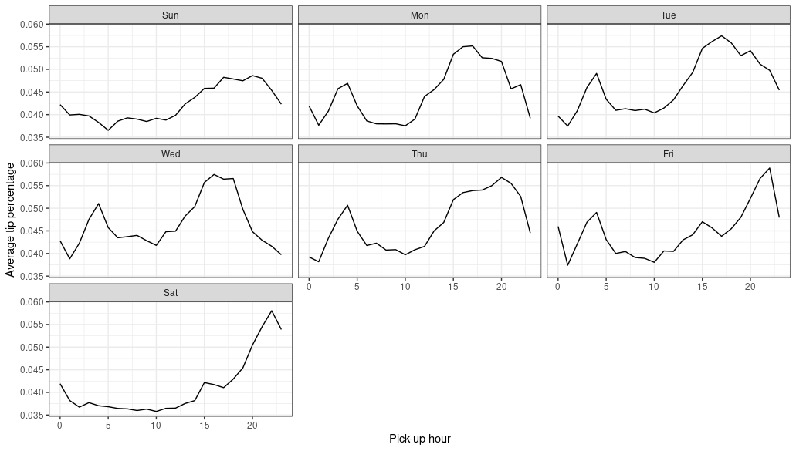

```{r include=FALSE}
knitr::opts_chunk$set(echo = TRUE, message = FALSE, warning = FALSE,
                      comment = "#>", highlight = TRUE,
                      fig.align = "center")
```

## Supplementary materials

Full video lecture available in Zoom Cloud Recordings

Additional resources

- [`sparklyr`: R interface for Apache Spark](https://spark.rstudio.com/)
- [R Front End for Apache Spark](http://spark.apache.org/docs/latest/api/R/index.html)
- [Mastering Spark with R](https://therinspark.com)

---

## Installing Spark

Install and load `sparklyr`.

```{r eval=FALSE}
install.packages("sparklyr")
```

```{r}
library(sparklyr)
library(tidyverse)
packageVersion("sparklyr")
```

--

Check the available versions of Spark to install.

```{r}
spark_available_versions()
```

---

## Installing Spark

Install version 3.0 with

```{r eval=FALSE}
spark_install("3.0")
```

Do this on your home directory on the server or on your own machine. Once
installed, you should see a directory `spark/` in your home directory.

---

class: inverse, center, middle

# Overview

---

## Timeline

- The amount of digital information surpasses analog information around 2003.
  Managing this data at scale becomes a real and present problem.

--

- Google presents a research paper in 2003 on the Google File System - this
  system allowed them to split information into several files and store them 
  across multiple machines.
  
--

- In 2004 Google publishes a paper describing how to processes on the
  Google File System, this approach came to be known as *MapReduce*.
  
--

- Shortly after Google's above publications, Yahoo begins work on an open source
  version of the Google File System and *MapReduce* algorithm.
  
--

- In 2006 Yahoo releases Hadoop and the Haddop Distributed File System (HDFS).
  Hadoop provides distributed storage (through the HDFS) and parallel processing
  of data (through a *MapReduce* algorithm) managed by a job scheduler and
  cluster manager (YARN).
  
--

- Facebook releases the Hive project in 2008 as way to bring SQL support to
  Hadoop. This alleviated the need of *MapReduce* operations to be written with
  JAVA code.

---

## Timeline (continued)

- In 2009 Apache Spark begins as a research project at UC Berkeley. Its goal is
  to improve on *MapReduce*, and facilitate and optimize code to be run on
  multiple machines.
  
--

- Shortly after, Spark supports loading data in-memory, making it much faster
  than Hadoop's on-disk storage.
  
--

- In 2010, Spark was released as an open source project and then donated to the 
  Apache Software Foundation in 2013. Spark is licensed under 
  [Apache 2.0](https://en.wikipedia.org/wiki/Apache_License), which 
  allows you to freely use, modify, and distribute it.

--

- In 2013 and 2016 Spark sets records for sorting speeds. How much faster is
  Spark than Hadoop? **It takes 72 minutes and 2,100 computers to sort 100 
  terabytes of data using Hadoop, but only 23 minutes and 206 computers 
  [using Spark](https://databricks.com/blog/2014/11/05/spark-officially-sets-a-new-record-in-large-scale-sorting.html).**

---

## What is Apache Spark?

- As described by Databricks, "Spark is a unified computing engine and a set
  of libraries for parallel data processing on computing clusters".

--
  
- Spark's goal is to support data analytics tasks within a single ecosystem:
  data loading, SQL queries, machine learning, and streaming computations.
  
--
  
- Spark is written in Scala and runs on Java. However, Spark can be used
  from R, Python, SQL, Scala, or Java.

---

## The Spark ecosystem


---

## Spark's key features

- In-memory computation

- Fast and scalable
    - Efficiently scale up from one to many thousands of compute nodes

- Access data on a multitude of platforms
    - SQL and NoSQL databses
    - Cloud storage
    - Hadoop Distributed File System

- Real-time stream processing

- Libraries
    - Spark SQL
    - MLlib
    - Spark streaming
    - GraphX

---

## What is `sparklyr`?

Package `sparklyr` provides an R interface for Spark. It works with any version
of Spark.

- Use `dplyr` to translate R code into Spark SQL

- Work with Spark's MLlib

- Interact with a stream of data

<center>

</center>

--

The interface between R and Spark is young. If you know Scala, a great project
would be to contribute to this R and Spark interaction by making Spark libraries
available as an R package.

---

class: inverse, center, middle

# Connecting to Spark

---

## Configure and connect

```{r eval=FALSE}
# add some custom configurations
conf <- list(
  sparklyr.cores.local = 4,
  `sparklyr.shell.driver-memory` = "16G",
  spark.memory.fraction = 0.5
)
```

`sparklyr.cores.local` - defaults to using all of the available cores

`sparklyr.shell.driver-memory` - limit is the amount of RAM available in the 
computer minus what would be needed for OS operations

`spark.memory.fraction` - default is set to 60% of the requested memory 
per executor

```{r eval=FALSE}
# create a spark connection
sc <- spark_connect(master = "local", version = "3.0", config = conf)
```

---

class: inverse, center, middle

# Analysis with `sparklyr`

---

## Overview

<center>


</center>

*Source*: https://therinspark.com/

---

## Adding data that exists in R

Use `dplyr`'s `copy_to()` to add data from R into Spark.

```{r eval=FALSE}
diamonds_tbl <- copy_to(sc, diamonds)
```

You should see `diamonds` in your connections tab as a Spark DataFrame. In
your environment you should see a list object named `diamonds_tbl`. This is
our R reference to `diamonds` in Spark.

--

<br/>

<center>

</center>

---

## Data preview

```{r eval=FALSE}
diamonds_tbl
```

```{r eval=FALSE}
*# Source: spark<diamonds> [?? x 10]
   carat cut       color clarity depth table price     x     y     z
   <dbl> <chr>     <chr> <chr>   <dbl> <dbl> <int> <dbl> <dbl> <dbl>
 1 0.23  Ideal     E     SI2      61.5    55   326  3.95  3.98  2.43
 2 0.21  Premium   E     SI1      59.8    61   326  3.89  3.84  2.31
 3 0.23  Good      E     VS1      56.9    65   327  4.05  4.07  2.31
 4 0.290 Premium   I     VS2      62.4    58   334  4.2   4.23  2.63
 5 0.31  Good      J     SI2      63.3    58   335  4.34  4.35  2.75
 6 0.24  Very Good J     VVS2     62.8    57   336  3.94  3.96  2.48
 7 0.24  Very Good I     VVS1     62.3    57   336  3.95  3.98  2.47
 8 0.26  Very Good H     SI1      61.9    55   337  4.07  4.11  2.53
 9 0.22  Fair      E     VS2      65.1    61   337  3.87  3.78  2.49
10 0.23  Very Good H     VS1      59.4    61   338  4     4.05  2.39
# … with more rows
```

---

## Adding external data

https://www1.nyc.gov/site/tlc/about/tlc-trip-record-data.page

```{r eval=FALSE}
taxi_path <- str_c("/home/fac/sms185/.public_html/data/taxi/",
                   "yellow_tripdata_2009-01.csv")

taxi_tbl <- spark_read_csv(sc, name = "yellow_taxi_2009", path = taxi_path)
```

Data can also be read into Spark DataFrames with `spark_read_json()`, `spark_read_parquet()`, and a few other functions for various types of file
formats.

---

## Data preview

.small[
```{r eval=FALSE}
glimpse(taxi_tbl)
```

```{r eval=FALSE}
*Rows: ??
Columns: 18
*Database: spark_connection
$ vendor_name           <chr> "VTS", "VTS", "VTS", "DDS", "DDS", "DDS", "DDS", "V…
$ Trip_Pickup_DateTime  <dttm> 2009-01-04 02:52:00, 2009-01-04 03:31:00, 2009-01-…
$ Trip_Dropoff_DateTime <dttm> 2009-01-04 03:02:00, 2009-01-04 03:38:00, 2009-01-…
$ Passenger_Count       <int> 1, 3, 5, 1, 1, 2, 1, 1, 1, 1, 1, 1, 2, 2, 1, 1, 1, …
$ Trip_Distance         <dbl> 2.63, 4.55, 10.35, 5.00, 0.40, 1.20, 0.40, 1.72, 1.…
$ Start_Lon             <dbl> -73.99196, -73.98210, -74.00259, -73.97427, -74.001…
$ Start_Lat             <dbl> 40.72157, 40.73629, 40.73975, 40.79095, 40.71938, 4…
$ Rate_Code             <chr> "NA", "NA", "NA", "NA", "NA", "NA", "NA", "NA", "NA…
$ store_and_forward     <chr> "NA", "NA", "NA", "NA", "NA", "NA", "NA", "NA", "NA…
$ End_Lon               <dbl> -73.99380, -73.95585, -73.86998, -73.99656, -74.008…
$ End_Lat               <dbl> 40.69592, 40.76803, 40.77023, 40.73185, 40.72035, 4…
$ Payment_Type          <chr> "CASH", "Credit", "Credit", "CREDIT", "CASH", "CASH…
$ Fare_Amt              <dbl> 8.9, 12.1, 23.7, 14.9, 3.7, 6.1, 5.7, 6.1, 8.7, 5.9…
$ surcharge             <dbl> 0.5, 0.5, 0.0, 0.5, 0.0, 0.5, 0.0, 0.5, 0.0, 0.0, 0…
$ mta_tax               <chr> "NA", "NA", "NA", "NA", "NA", "NA", "NA", "NA", "NA…
$ Tip_Amt               <dbl> 0.00, 2.00, 4.74, 3.05, 0.00, 0.00, 1.00, 0.00, 1.3…
$ Tolls_Amt             <dbl> 0, 0, 0, 0, 0, 0, 0, 0, 0, 0, 0, 0, 0, 0, 0, 0, 0, …
$ Total_Amt             <dbl> 9.40, 14.60, 28.44, 18.45, 3.70, 6.60, 6.70, 6.60, …

```
]

---

## Basic wrangling

```{r eval=FALSE}
diamonds_tbl %>% 
  group_by(cut) %>% 
  summarise(mean_price = mean(price, na.rm = TRUE))
```

```{r eval=FALSE}
# Source: spark<?> [?? x 2]
  cut       mean_price
  <chr>          <dbl>
1 Premium        4584.
2 Ideal          3458.
3 Good           3929.
4 Fair           4359.
5 Very Good      3982.
```

<br/>

--

The data is not being imported back into R. We can do that with `collect()`.

---

## Basic wrangling

```{r eval=FALSE}
diamonds_tbl %>% 
  group_by(cut) %>% 
  summarise(mean_price = mean(price, na.rm = TRUE)) %>% 
  collect() #<<
```

```{r eval=FALSE}
*# A tibble: 5 x 2
  cut       mean_price
  <chr>          <dbl>
1 Premium        4584.
2 Ideal          3458.
3 Good           3929.
4 Fair           4359.
5 Very Good      3982.
```

---

## What's happening under the hood?

```{r eval=FALSE}
diamonds_tbl %>% 
  group_by(cut) %>% 
  summarise(mean_price = mean(price, na.rm = TRUE)) %>% 
  show_query() #<<
```

--

```{sql eval=FALSE}
<SQL>
SELECT `cut`, AVG(`price`) AS `mean_price`
FROM `diamonds`
GROUP BY `cut`
```

This is the SQL statement that `sparklyr` and `dplyr` created and sent to Spark.
We could write the SQL ourselves, but dplyr is easier.

---

## R limitations

Rather than compute the mean, let's try to compute the 75th percentile.

```{r eval=FALSE}
diamonds_tbl %>% 
  group_by(cut) %>% 
  summarise(q_75 = quantile(price, probs = .75))
```

--

```{r eval=FALSE}
Error: org.apache.spark.sql.catalyst.parser.ParseException: 
no viable alternative at input 'GROUP ('(line 1, pos 49)

== SQL ==
SELECT `cut`, PERCENTILE_CONT(0.75) WITHIN GROUP (ORDER BY `price`) AS `q_75`
-------------------------------------------------^^^
FROM `diamonds`
GROUP BY `cut`
```

--

The problem is that there is no translation for function `quantile()`.

---

## Hive SQL functions

Spark SQL is based on Hive SQL conventions and functions. If `sparklyr` and
`dplyr` can't do the translation we need, we can use Hive functions directly
in our R code that will ultimately get passed on to Spark SQL. A list of
available [Hive functions can be found here.](https://cwiki.apache.org/confluence/display/Hive/LanguageManual+UDF)

--

```{r eval=FALSE}
diamonds_tbl %>% 
  group_by(cut) %>% 
  summarise(q_75 = percentile(price, 0.75)) #<<
```

```{r eval=FALSE}
# Source: spark<?> [?? x 2]
  cut        q_75
  <chr>     <dbl>
1 Premium   6296 
2 Ideal     4678.
3 Good      5028 
4 Fair      5206.
5 Very Good 5373.
```

--

**Function `percentile()` is not an R function. It's a Hive function! **

---

## Show query result

```{r eval=FALSE}
diamonds_tbl %>% 
  group_by(cut) %>% 
  summarise(q_75 = percentile(price, 0.75)) %>% 
  show_query()
```

```{sql eval=FALSE}
<SQL>
SELECT `cut`, percentile(`price`, 0.75) AS `q_75`
FROM `diamonds`
GROUP BY `cut`
```

---

class: inverse, center, middle

# January 2009 Yellow Cab Analysis

---

## Data recall

```{r eval=FALSE}
taxi_tbl
```

```{r eval=FALSE}
taxi_tbl
# Source: spark<yellow_taxi_2009> [?? x 18]
   vendor_name Trip_Pickup_DateTi… Trip_Dropoff_DateT… Passenger_Count Trip_Distance Start_Lon
   <chr>       <dttm>              <dttm>                        <int>         <dbl>     <dbl>
 1 VTS         2009-01-04 02:52:00 2009-01-04 03:02:00               1          2.63     -74.0
 2 VTS         2009-01-04 03:31:00 2009-01-04 03:38:00               3          4.55     -74.0
 3 VTS         2009-01-03 15:43:00 2009-01-03 15:57:00               5         10.4      -74.0
 4 DDS         2009-01-01 20:52:58 2009-01-01 21:14:00               1          5        -74.0
 5 DDS         2009-01-24 16:18:23 2009-01-24 16:24:56               1          0.4      -74.0
 6 DDS         2009-01-16 22:35:59 2009-01-16 22:43:35               2          1.2      -74.0
 7 DDS         2009-01-21 08:55:57 2009-01-21 09:05:42               1          0.4      -74.0
 8 VTS         2009-01-04 04:31:00 2009-01-04 04:36:00               1          1.72     -74.0
 9 CMT         2009-01-05 16:29:02 2009-01-05 16:40:21               1          1.6      -74.0
10 CMT         2009-01-05 18:53:13 2009-01-05 18:57:45               1          0.7      -74.0
# … with more rows, and 12 more variables: Start_Lat <dbl>, Rate_Code <chr>,
#   store_and_forward <chr>, End_Lon <dbl>, End_Lat <dbl>, Payment_Type <chr>, Fare_Amt <dbl>,
#   surcharge <dbl>, mta_tax <chr>, Tip_Amt <dbl>, Tolls_Amt <dbl>, Total_Amt <dbl>
```

---

## Clean up the variable names

Try to clean the names up with `janitor::clean_names()`.

```{r eval=FALSE}
janitor::clean_names(taxi_tbl)
```

```{r eval=FALSE}
Error in clean_names.default(taxi_tbl) : 
  clean_names() must be called on a data.frame.  
  Consider janitor::make_clean_names() for other 
  cases of manipulating vectors of names.
```

What's happening?

--

```{r eval=FALSE}
names(taxi_tbl)
```

```{r eval=FALSE}
[1] "src" "ops"
```

Object `taxi_tbl` is a list specifying the connection. What can we do?

---

## Fix names

Function `colnames()` seems to work.

```{r eval=FALSE}
colnames(taxi_tbl)
```

```{r eval=FALSE}
 [1] "vendor_name"           "Trip_Pickup_DateTime"  "Trip_Dropoff_DateTime" "Passenger_Count"      
 [5] "Trip_Distance"         "Start_Lon"             "Start_Lat"             "Rate_Code"            
 [9] "store_and_forward"     "End_Lon"               "End_Lat"               "Payment_Type"         
[13] "Fare_Amt"              "surcharge"             "mta_tax"               "Tip_Amt"              
[17] "Tolls_Amt"             "Total_Amt"   
```

--

Create a function, `fix_names()`, that provides a more uniform structure
given our `taxi_tbl` object

```{r}
fix_names <- function(x) {
  colnames(x) %>% 
    tolower() %>% 
    stringr::str_remove(pattern = "trip_") %>% 
    setNames(x, .)
}
```

Why does `colnames()` work here? 
See http://spark.apache.org/docs/latest/api/R/index.html.

---

```{r eval=FALSE}
taxi_tbl <- fix_names(taxi_tbl)
```

--

```{r eval=FALSE}
colnames(taxi_tbl)
```

```{r eval=FALSE}
 [1] "vendor_name"       "pickup_datetime"   "dropoff_datetime" 
 [4] "passenger_count"   "distance"          "start_lon"        
 [7] "start_lat"         "rate_code"         "store_and_forward"
[10] "end_lon"           "end_lat"           "payment_type"     
[13] "fare_amt"          "surcharge"         "mta_tax"          
[16] "tip_amt"           "tolls_amt"         "total_amt"     
```

--

```{r eval=FALSE}
taxi_tbl
```

```{r eval=FALSE}
# Source: spark<yellow_taxi_2009> [?? x 18]
   vendor_name pickup_datetime     dropoff_datetime    passenger_count distance
   <chr>       <dttm>              <dttm>                        <int>    <dbl>
 1 VTS         2009-01-04 02:52:00 2009-01-04 03:02:00               1     2.63
 2 VTS         2009-01-04 03:31:00 2009-01-04 03:38:00               3     4.55
 3 VTS         2009-01-03 15:43:00 2009-01-03 15:57:00               5    10.4 
# … with more rows, and 13 more variables: start_lon <dbl>, start_lat <dbl>,
#   rate_code <chr>, store_and_forward <chr>, end_lon <dbl>, end_lat <dbl>,
#   payment_type <chr>, fare_amt <dbl>, surcharge <dbl>, mta_tax <chr>,
#   tip_amt <dbl>, tolls_amt <dbl>, total_amt <dbl>
```

---

## Fix `payment_type`

.tiny[
```{r eval=FALSE}
taxi_tbl %>% 
  group_by(payment_type) %>% 
  summarise(count = n())
```

```{r eval=FALSE}
# Source: spark<?> [?? x 2] #<<
  payment_type   count
  <chr>          <dbl>
1 No Charge      40118
2 CASH         6024471
3 Credit       2865982
4 Cash         4995101
5 Dispute         8050
6 CREDIT        158691
```
]

--

.tiny[
```{r eval=FALSE}
taxi_tbl %>% 
  mutate(payment_type = tolower(payment_type)) %>% 
  show_query() #<<
```

```{sql eval=FALSE}
<SQL>
SELECT `vendor_name`, `pickup_datetime`, `dropoff_datetime`, `passenger_count`, 
`distance`, `start_lon`, `start_lat`, `rate_code`, `store_and_forward`, 
`end_lon`, `end_lat`, LOWER(`payment_type`) AS `payment_type`, `fare_amt`, 
`surcharge`, `mta_tax`, `tip_amt`, `tolls_amt`, `total_amt`
FROM `yellow_taxi_2009`
```
]

---

Transform all payment types to lower case.

```{r eval=FALSE}
taxi_tbl <- taxi_tbl %>% 
  mutate(payment_type = tolower(payment_type))
```

--

Bring everything back to R with `collect()` and check our result.

```{r eval=FALSE}
taxi_tbl %>% 
  group_by(payment_type) %>% 
  summarise(count = n()) %>% 
  collect() #<<
```

```{r eval=FALSE}
# A tibble: 4 x 2
  payment_type    count
  <chr>           <dbl>
1 cash         11019572
2 no charge       40118
3 dispute          8050
4 credit        3024673
```

---

## Summary analysis

Let's compute some summary information about taxi trips.

```{r eval=FALSE}
taxi_tbl %>% 
  select(passenger_count, distance, tip_amt, fare_amt, total_amt) %>% 
  mutate(
    cost_per_passenger = passenger_count / total_amt,
    tip_pct            = tip_amt / fare_amt,
    cost_per_mile      = fare_amt / distance
  )
```

--

```{r eval=FALSE}
# Source: spark<?> [?? x 8]
   passenger_count distance tip_amt fare_amt total_amt
             <int>    <dbl>   <dbl>    <dbl>     <dbl>
 1               1     2.63    0         8.9       9.4
 2               3     4.55    2        12.1      14.6
 3               5    10.4     4.74     23.7      28.4
 4               1     5       3.05     14.9      18.4
 5               1     0.4     0         3.7       3.7
# … with more rows, and 3 more variables: cost_per_passenger <dbl>,
#   tip_pct <dbl>, cost_per_mile <dbl>
```

---

What query is being made with regards to Spark?

```{r eval=FALSE}
taxi_tbl %>% 
  select(passenger_count, distance, tip_amt, fare_amt, total_amt) %>% 
  mutate(
    cost_per_passenger = passenger_count / total_amt,
    tip_pct            = tip_amt / fare_amt,
    cost_per_mile      = fare_amt / distance
  ) %>% 
  show_query() #<<
```

--

```{r eval=FALSE}
<SQL>
SELECT `passenger_count`, `distance`, `tip_amt`, `fare_amt`, 
`total_amt`, 
`passenger_count` / `total_amt` AS `cost_per_passenger`, 
`tip_amt` / `fare_amt` AS `tip_pct`, 
`fare_amt` / `distance` AS `cost_per_mile`
FROM `yellow_taxi_2009`
```

---

Next, let's parse `pickup_datetime` to get the hour, day (as a name), 
month (as a name). We'll also include the tip percentage and fare cost per mile.
Lastly we'll compute some summary measures.

```{r eval=FALSE}
taxi_tbl_summary <- taxi_tbl %>% 
  select(pickup_datetime, dropoff_datetime, distance, 
         fare_amt, tip_amt, total_amt) %>% 
  mutate(
    pickup_day    = date_format(pickup_datetime, "EEE"), #<<
    pickup_hour   = hour(pickup_datetime)), #<<
    tip_pct       = tip_amt / fare_amt,
    fare_per_mile = fare_amt / distance
  ) %>% 
  group_by(pickup_hour, pickup_day) %>% 
  summarise(
    avg_dist          = mean(distance),
    avg_fare          = mean(fare_amt),
    avg_tip_pct       = mean(tip_pct),
    avg_fare_per_mile = mean(fare_per_mile)
  ) %>% 
  collect()
```

---

```{r eval=FALSE}
taxi_tbl_summary
```

```{r eval=FALSE}
# A tibble: 168 x 6
   pickup_hour pickup_day avg_dist avg_fare avg_tip_pct avg_fare_per_mile
         <int> <chr>         <dbl>    <dbl>       <dbl>             <dbl>
 1           1 Thu            3.08    10.5       0.0448              5.33
 2           7 Sun            3.68    11.6       0.0401              5.32
 3           8 Sat            2.82     9.37      0.0377              5.00
 4           6 Tue            2.85     9.33      0.0375              5.29
 5          11 Fri            2.33     9.23      0.0400              6.25
 6           0 Wed            3.16    10.4       0.0530              5.38
 7           6 Mon            3.12     9.95      0.0377              5.16
 8          17 Mon            2.41     9.36      0.0440              5.91
 9          16 Thu            2.34     9.85      0.0408             13.0 
10          10 Wed            2.13     8.98      0.0457              6.49
# … with 158 more rows
```

---

We can now use `taxi_tbl_summary` just as we would any other object in R.

```{r eval=FALSE}
taxi_tbl_summary %>% 
  ggplot(aes(x = pickup_hour, y = avg_tip_pct)) +
  geom_line() +
  facet_wrap(~factor(pickup_day, levels = c("Sun", "Mon", "Tue", "Wed",
                                            "Thu", "Fri", "Sat"))) +
  labs(x = "Pick-up hour", y = "Average tip percentage") +
  theme_bw()
```

<center>

</center>

---

## Other useful functions

- Perform joins with the `*_join()` family of functions.

- Sampling can be done with `sample_n()` and `sample_frac()`.

- Write the results of your analysis into persistent storage with
  `spark_write_parquet()`, `spark_write_csv()`, or `spark_write_json()`.

---

## Family of `sparklyr` functions

| Sparklyr family of functions | Description                                                                                     |
|-----------------------------:|:------------------------------------------------------------------------------------------------|
|               `spark_*()`    | functions to manage and configure spark connections; <br>functions to read and write data       |
|                 `sdf_*()`    | functions for manipulating SparkDataFrames                                                      |
|                  `ft_*()`    | feature transformers for manipulating individual features                                       |
|                  `ml_*()`    | machine learning algorithms - K-Means, GLM, Survival Regression, <br>PCA, Naive-Bayes, and more |
|              `stream_*()`    | functions for handling stream data                                                              |

---

## Exercise

Plot the pick-up locations for January 1, 2009 and January 2, 2009. Color
code the points based on the price of the cab ride with buckets of [0, 10],
(10, 20], and 20+. Do all your data wrangling in Spark and only collect
the final tibble to plot using `ggplot2` in R.

---

## References

1. A Gentle Introduction to Apache Spark. (2020). 
   http://www.dcs.bbk.ac.uk/~dell/teaching/cc/book/databricks/spark-intro.pdf.
   
2. Javier Luraschi, E. (2020). Mastering Spark with R. https://therinspark.com/.

3. R Front End for Apache Spark. (2020). 
   http://spark.apache.org/docs/latest/api/R/index.html.

4. sparklyr. (2020). https://spark.rstudio.com/.


