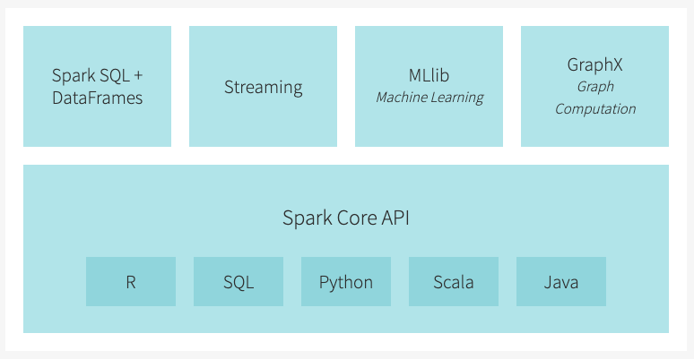
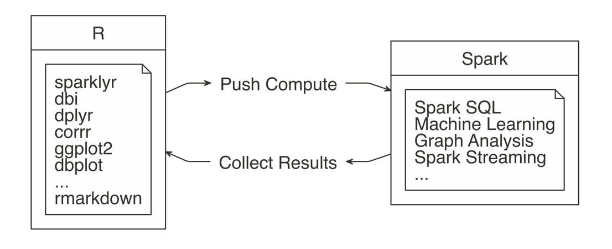
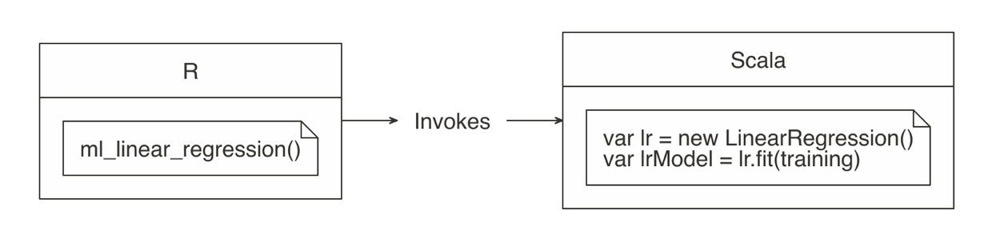
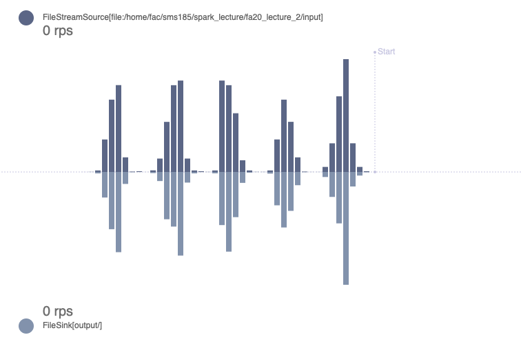

```{r include=FALSE}
knitr::opts_chunk$set(eval = FALSE, echo = TRUE, message = FALSE, 
                      warning = FALSE, comment = "#>", highlight = TRUE,
                      fig.align = "center")
```

## Supplementary materials

Full video lecture available in Zoom Cloud Recordings

Additional resources

- [`sparklyr`: R interface for Apache Spark](https://spark.rstudio.com/)
- [R Front End for Apache Spark](http://spark.apache.org/docs/latest/api/R/index.html)
- [Mastering Spark with R](https://therinspark.com)

---

class: inverse, center, middle

# Recall

---

## The Spark ecosystem



---

## What is `sparklyr`?

Package `sparklyr` provides an R interface for Spark. It works with any version
of Spark.

- Use `dplyr` to translate R code into Spark SQL

- Work with Spark's MLlib

- Interact with a stream of data

<center>

</center>

--

The interface between R and Spark is young. If you know Scala, a great project
would be to contribute to this R and Spark interaction by making Spark libraries
available as an R package.

---

## Workflow

<center>


</center>

*Source*: https://therinspark.com/

---

class: inverse, center, middle

# Preliminaries

---

## Configure and connect

```{r}
library(sparklyr)
library(tidyverse)
library(future)
# add some custom configurations
conf <- list(
  sparklyr.cores.local = 4,
  `sparklyr.shell.driver-memory` = "16G",
  spark.memory.fraction = 0.5
)
```

`sparklyr.cores.local` - defaults to using all of the available cores

`sparklyr.shell.driver-memory` - limit is the amount of RAM available in the 
computer minus what would be needed for OS operations

`spark.memory.fraction` - default is set to 60% of the requested memory 
per executor

```{r}
# create a spark connection
sc <- spark_connect(master = "local", version = "3.0", config = conf)
```

---

class: inverse, center, middle

# Spark Streaming

---

## What is Spark Streaming?

>"Spark Streaming makes it easy to build scalable fault-tolerant streaming
  applications."
  
Streaming data:

- Financial asset prices (stocks, futures, cryptocurrency, etc.)
- Twitter feed
- Purchase orders on Amazon

Think of streaming data as real-time data. Streams are most relevant when we
want to process and analyze this data in real time.

---

## The role of `sparklyr`

`sparklyr` provides an R interface for interacting with Spark Streaming by 
allowing you to

- run `dplyr`, SQL, and pipeline machine learning models against a stream of
  data;
  
- read in many file formats (CSV, text, JSON, parquet, etc.) from a stream 
  source;
  
- write stream results in the file formats specified above;

- integration with Shiny that allows you to get the contents of a stream in
  your app.

---

## Spark Streaming process

Streams in Spark follow a **source** (think reading), **transformation**, and
**sink** (think writing) process.

--

**Source:**

There exists a set of `stream_read_*()` functions in `sparklyr` for reading
the specified file type in as a Spark DataFrame stream.

--

**Transformation:**

Spark (via `sparklyr`) can then perform data wrangling, manipulations, and joins
with other streaming or static data, machine learning pipeline predictions, and 
other R manipulations.

--

**Sink:**

There exists a set of `stream_write_*()` functions in `sparklyr` for writing
a Spark DataFrame stream as the specified file type.

---

## Toy example

Let's leave out the transformation step and simply define a streaming process
that reads files from a folder `input_source/` and immediately writes them to a
folder `output_source/`.

```{r}
dir.create("input_source/")
dir.create("output_source/")
stream <- stream_read_text(sc, path = "input_source/") %>%
  stream_write_text(path = "output_source/")
```

--

Generate 100 test files to see that they are being read and written to and 
from the correct directories. Function `stream_view()` launches a Shiny gadget 
to visualize the given stream. You can see the rows per second (rps) being 
read and written.

```{r}
stream_generate_test(interval = .2, iterations = 100, 
                            path = "input_source/")
stream_view(stream)
```

--

Stop the stream and remove the `input_source/` and `output_source/` directories.

```{r}
stream_stop(stream)
unlink("input_source/", recursive = TRUE)
unlink("output_source/", recursive = TRUE)
```

---

## Stream viewer

<center>

</center>

---

## Toy example details

```{r}
stream <- stream_read_text(sc, path = "input_source/") %>%
  stream_write_text(path = "output_source/") #<<
```

The output writer is what starts the streaming job. It will start monitoring 
the input folder, and then write the new results in the `output_source/` folder.

--

<br/>

The stream query defaults to micro-batches running every 5 seconds. This
can be adjusted with `stream_trigger_interval()` and 
`stream_trigger_continuous()`. 

---

## Example with transformations

Using the tibble `diamonds` from `ggplot2`, let's create a stream, do some
aggregation, and output the process to memory as a Spark DataFrame. Using Spark 
memory as the target will allow for aggregation to happen during processing.
*On all but Kafka, aggregation is not allowed for any file output.*

```{r}
dir.create("input_source/")
stream_generate_test(df = diamonds, path = "input_source/", 
                     iterations = 1)
```

```{r}
stream <- stream_read_csv(sc, path = "input_source/") %>% 
  select(price) %>% 
  stream_watermark() %>%   # add a timestamp
  group_by(timestamp) %>%  # do a grouping by the timestamp
    summarise(
      min_price  = min(price, na.rm = TRUE),
      max_price  = max(price, na.rm = TRUE),
      mean_price = mean(price, na.rm = TRUE),
      count      = n()
  ) %>%
  stream_write_memory(name = "diamonds_sdf")
```

Object `diamonds_sdf` will be a Spark DataFrame to which our summarized
streaming computations are written.

---

## Example with transformations

Generate some test data using `diamonds`.

```{r}
stream_generate_test(df = diamonds, path = "input_source/", iterations = 10)
```

<br/>

We can periodically check the results.

```{r}
tbl(sc, "diamonds_sdf")
```

--

<br/>

Stop the stream and remove the `input_source/` and `output_source/` directories.

```{r}
stream_stop(stream)
unlink("input_source/", recursive = TRUE)
```

---

## Shiny and streaming

Shiny’s reactive framework is well suited to support streaming information, 
which you can use to display real-time data from Spark using `reactiveSpark()`.
It can take a Spark DataFrame (or an object coercable to one), and it
returns a reactive data source. You can use it similar to how you used
reactive tibble objects.

--

<br/>

To demonstrate the functionality of `reactiveSpark()`, we'll again use the
NYC yellow taxi trip data from January 2009.

https://www1.nyc.gov/site/tlc/about/tlc-trip-record-data.page

```{r eval=FALSE}
taxi_path <- str_c("/home/fac/sms185/.public_html/data/taxi/",
                   "yellow_tripdata_2009-01.csv")

taxi_tbl <- spark_read_csv(sc, name = "yellow_taxi_2009", 
                           path = taxi_path)
```

---

## Data preview

.small[
```{r eval=FALSE}
glimpse(taxi_tbl)
```

```{r eval=FALSE}
*Rows: ??
Columns: 18
*Database: spark_connection
$ vendor_name           <chr> "VTS", "VTS", "VTS", "DDS", "DDS", "DDS", "DDS", "V…
$ Trip_Pickup_DateTime  <dttm> 2009-01-04 02:52:00, 2009-01-04 03:31:00, 2009-01-…
$ Trip_Dropoff_DateTime <dttm> 2009-01-04 03:02:00, 2009-01-04 03:38:00, 2009-01-…
$ Passenger_Count       <int> 1, 3, 5, 1, 1, 2, 1, 1, 1, 1, 1, 1, 2, 2, 1, 1, 1, …
$ Trip_Distance         <dbl> 2.63, 4.55, 10.35, 5.00, 0.40, 1.20, 0.40, 1.72, 1.…
$ Start_Lon             <dbl> -73.99196, -73.98210, -74.00259, -73.97427, -74.001…
$ Start_Lat             <dbl> 40.72157, 40.73629, 40.73975, 40.79095, 40.71938, 4…
$ Rate_Code             <chr> "NA", "NA", "NA", "NA", "NA", "NA", "NA", "NA", "NA…
$ store_and_forward     <chr> "NA", "NA", "NA", "NA", "NA", "NA", "NA", "NA", "NA…
$ End_Lon               <dbl> -73.99380, -73.95585, -73.86998, -73.99656, -74.008…
$ End_Lat               <dbl> 40.69592, 40.76803, 40.77023, 40.73185, 40.72035, 4…
$ Payment_Type          <chr> "CASH", "Credit", "Credit", "CREDIT", "CASH", "CASH…
$ Fare_Amt              <dbl> 8.9, 12.1, 23.7, 14.9, 3.7, 6.1, 5.7, 6.1, 8.7, 5.9…
$ surcharge             <dbl> 0.5, 0.5, 0.0, 0.5, 0.0, 0.5, 0.0, 0.5, 0.0, 0.0, 0…
$ mta_tax               <chr> "NA", "NA", "NA", "NA", "NA", "NA", "NA", "NA", "NA…
$ Tip_Amt               <dbl> 0.00, 2.00, 4.74, 3.05, 0.00, 0.00, 1.00, 0.00, 1.3…
$ Tolls_Amt             <dbl> 0, 0, 0, 0, 0, 0, 0, 0, 0, 0, 0, 0, 0, 0, 0, 0, 0, …
$ Total_Amt             <dbl> 9.40, 14.60, 28.44, 18.45, 3.70, 6.60, 6.70, 6.60, …

```
]

---

## Sample Taxi data

Define a bounding box for NYC.

```{r}
min_lat <- 40.5774
max_lat <- 40.9176
min_lon <- -74.15
max_lon <- -73.7004
```

--

<br/>

Take a sample of about 10% of the trips, where the trip start is within our
bounding box defined above.

```{r}
taxi <- taxi_tbl %>% 
  sample_frac(size = 0.1) %>% 
  collect() %>% 
  janitor::clean_names() %>% 
  filter(start_lon >= min_lon, start_lon <= max_lon, 
         start_lat >= min_lat, start_lat <= max_lat)
```

---

## Streaming Shiny gadget

```{r}
library(shiny)
```

```{r}
unlink("shiny-stream", recursive = TRUE)
dir.create("shiny-stream", showWarnings = FALSE)
```

--

To generate test data, we'll do this with our own code.

```{r}
library(tidyverse)
write_stream_csv <- function(x, row, path = "shiny-stream/", pause = 2) {
  x %>% 
    slice(row) %>% 
    write_csv(file = str_c(path, "stream_", row, ".csv"))
  Sys.sleep(pause)
}

trips <- sample(1:nrow(taxi))
walk(trips, write_stream_csv, x = taxi)
```

Run this as a local background job from a script file. This way you can
launch the Shiny App (on the next slide) in RStudio.

---

## Streaming Shiny gadget

Once the local job starts running, launch the app to see how the plot updates
as we simulate more taxi trips beginning.

```{r}
ui <- function() {
  plotOutput("taxi_plot")
}

server <- function(input, output, session) {
  taxi_stream <- stream_read_csv(sc, path = "shiny-stream") %>%
    reactiveSpark() #<<

  output$taxi_plot <- renderPlot({
    ggplot(taxi_stream(), aes(y = start_lat, x = start_lon)) +
      geom_point(alpha = 0.3) +
      labs(y = "Latitude", x = "Longitude") +
      theme_bw(base_size = 16)
  })
}

runGadget(ui, server)
```

---

## References

1. A Gentle Introduction to Apache Spark. (2020). 
   http://www.dcs.bbk.ac.uk/~dell/teaching/cc/book/databricks/spark-intro.pdf.
   
2. Javier Luraschi, E. (2020). Mastering Spark with R. https://therinspark.com/.

3. R Front End for Apache Spark. (2020). 
   http://spark.apache.org/docs/latest/api/R/index.html.

4. sparklyr. (2020). https://spark.rstudio.com/.


